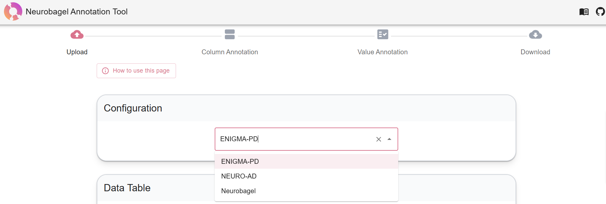

# Community vocabularies for consortia (beta)

!!! info
    This section describes an early-stage feature under active development,
    currently targeted at research consortia.

We are actively developing support for Neurobagel "community" vocabularies: custom standardized vocabularies of terms which are curated and governed by research consortia.
This feature allows you to use more detailed or domain-specific standardized terms than are available in the [core set of external ontologies](dictionaries.md) provided by Neurobagel,
providing more precision when harmonizing phenotypic data across sites in your consortium.

Neurobagel services provide early-stage support for community vocabularies.
For example, members of your consortium can use our [beta annotation tool](https://beta-annotate.neurobagel.org/)
to annotate their tabular data with your specific community vocabulary.

Example of community vocabulary selection in the beta annotation tool:

We have developed an initial workflow for creating a community vocabulary of **assessment terms** for Neurobagel.
If your research consortium is interested in being onboarded as a Neurobagel community, we invite you to [contact the Neurobagel maintainer team](../getting_help.md).

For more information on creating a community vocabulary for your consortium, see the [neurobagel/communities](https://github.com/neurobagel/communities/blob/main/README.md) repository.
