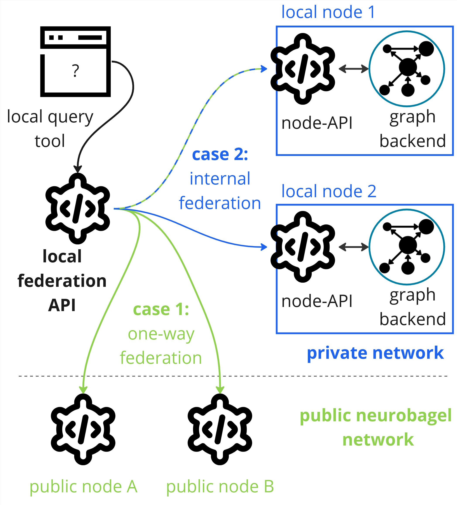

## When to use local query federation
There are two main reasons to deploy local query federation:

- **Case 1**: one-way federation. You have (at least) one [local neurobagel
node](infrastructure.md) and you want your users to be able to search
the data in the local node alongside all the publicly
visible data in the neurobagel network.
- **Case 2**: internal federation. You have two or more local neurobagel
nodes (e.g. for data from different groups in your institute)
and you want your local users to search across all of them.



Note that these cases are not mutually exclusive. 
Any local neurobagel nodes you deploy will only be visible to users
inside of your local network (internal federation).

## When not to use local query federation
Query federation is not necessary, if you:

- **only want to query public neurobagel nodes**:
  Existing public nodes in the neurobagel network are accessible
  to everyone via our public query tool (e.g. on [query.neurobagel.org](https://query.neurobagel.org/)),
  meaning you can run federated queries over these graph databases without any additional local setup.
- **you only want to search a single neurobagel node**:
  If you only have one local node that you want to query,
  it is easier to directly query the node-API of this node.
  In that case, all you have to do is follow the [deployment instructions
  for a neurobagel node](infrastructure.md) and you are good to go.

## Setting up for local federation
Federated graph queries in neurobagel are provided by the federation API (`f-API`) service.
The neurobagel `f-API` takes a single user query and then sends it to every
neurobagel node API (`n-API`) it is aware of, collects and combines the responses,
and sends them back to the user as a single answer.

!!! note

    Make sure you have at least one [local `n-API` configured and running](infrastructure.md)
    before you set up local federation. If you do not have any local
    `n-APIs` to federate over, you can just use our public query tool directly at [query.neurobagel.org](https://query.neurobagel.org/).

In your command line, create and navigate to a new directory where you will keep the configuration files for your new `f-API`. 
In this directory, create three files:


### `local_nb_nodes.json` configuration file
Create a JSON file called `local_nb_nodes.json` which will contain the URLs and (arbitrary) names of the local nodes you wish to federate over.
Each node must be denoted by a dictionary `{}` with two key-value pairs:  
`"NodeName"` for the name of the node,  
`"ApiURL"` for the URL of the API exposed for that node.  
Multiple nodes must be wrapped in a list `[]`.

Let's assume there are two local nodes already running on different servers of your institutional network, and you want to set up federation across both nodes:

- a node named `"node_archive"` running on your local computer (localhost), on port `8000` and 
- a node named `"node_recruitment"` running on a different computer with the local IP `192.168.0.1`, listening on the default http port `80`. 

In your `local_nb_nodes.json` file you would configure this as follows:
``` {.json title="local_nb_nodes.json"}
[
  {
    "NodeName": "node_archive",
    "ApiURL": "http://host.docker.internal:8000",
  },
  {
    "NodeName": "node_recruitment",
    "ApiURL": "http://192.168.0.1"
  }
]
```

!!! warning "Do not use `localhost`/`127.0.0.1` in `local_nb_nodes.json`"

    If the local node API(s) you are federating over is running on the same host machine as your federation API (e.g., the URL to access the node API is http://localhost:XXXX), make sure that you replace `localhost` with `host.docker.internal` in the `"ApiURL"` for the node inside `local_nb_nodes.json`.
    For an example, see the configuration for the node called `"node_archive"` above.


!!! Info "Nodes that do not need to be manually configured"
    We maintain a list of public Neurobagel nodes 
    [here](https://github.com/neurobagel/menu/blob/main/node_directory/neurobagel_public_nodes.json).
    By default every new `f-API` will lookup this list
    on startup and include it in the list of nodes to
    federate over.
    This also means that you do not have to manually
    configure public nodes, i.e. you **do not have to explicitly add them** to your `local_nb_nodes.json` file.

To add one or more local nodes to the list of nodes known to your `f-API`, simply add more dictionaries to this file.


### `fed.env` environment file 

Create a text file called `fed.env` to hold environment variables needed for the `f-API` deployment. 

``` {.bash .annotate title="fed.env"}
# Configuration for f-API
# Define the port that the f-API will run on INSIDE the docker container (default 8000)
NB_API_PORT=8000
# Define the port that the f-API will be exposed on to the host computer (and likely the outside network)
NB_API_PORT_HOST=8080
# Chose the docker image tag of the f-API (default latest)
NB_API_TAG=latest

# Configuration for query tool
# Define the URL of the f-API as it will appear to a user
API_QUERY_URL=http://localhost:8080 # (1)!
# Chose the docker image tag of the query tool (default latest)
NB_QUERY_TAG=latest
# Chose the port that the query tool will be exposed on the host and likely the network (default 3000)
NB_QUERY_PORT_HOST=3000
```

1.  When a user users the graphical query tool to query your
    f-API, these requests will be sent from the users machine,
    not from the machine hosting the query tool.

    Make sure you set the `API_QUERY_URL` in your `fed.env`
    as it will appear to a user on their own machine 
    - otherwise the request will fail..

Copy and adjust the above code snippet according to your own deployment, and store it in `fed.env`.


### `docker-compose.yml` docker config file

Create a second file called `docker-compose.yml`. 
This file describes the required services, ports and paths
to launch the `f-API` together with a connected query tool.

!!! danger "Make sure you have a recent version of docker compose installed"

    Some Linux distributions come with outdated versions of `docker` and 
    `docker compose` installed. Please make sure you install `docker` 
    as described in the [official documentation](https://docs.docker.com/engine/install/).

Copy the following snippet into your `docker-compose.yml` file.
You should not have to change anything about this file.
All local configuration changes should be made in either the `local_nb_nodes.json` or `fed.env` files.

``` {.yaml .annotate title="docker-compose.yml"}
version: "3.8"

services:
  federation:
    image: "neurobagel/federation_api:${NB_API_TAG:-latest}"
    ports:
      - "${NB_API_PORT_HOST:-8000}:${NB_API_PORT:-8000}"
    volumes:
      - "${PWD}/local_nb_nodes.json:/usr/src/local_nb_nodes.json:ro"
    environment:
      - NB_API_PORT=${NB_API_PORT:-8000}
    extra_hosts:
      - "host.docker.internal:host-gateway"
  query:
    image: "neurobagel/query_tool:${NB_QUERY_TAG:-latest}"
    ports:
      - "${NB_QUERY_PORT_HOST:-3000}:3000"
    environment:
      - API_QUERY_URL=${API_QUERY_URL:-http://localhost:8000/}
```


## Launch f-API and query tool
Once you have created your `local_nb_nodes.json`, `fed.env`, and `docker-compose.yml` files as described above, you can simply launch the services by running

`docker compose --env-file fed.env up -d`

from the same directory.