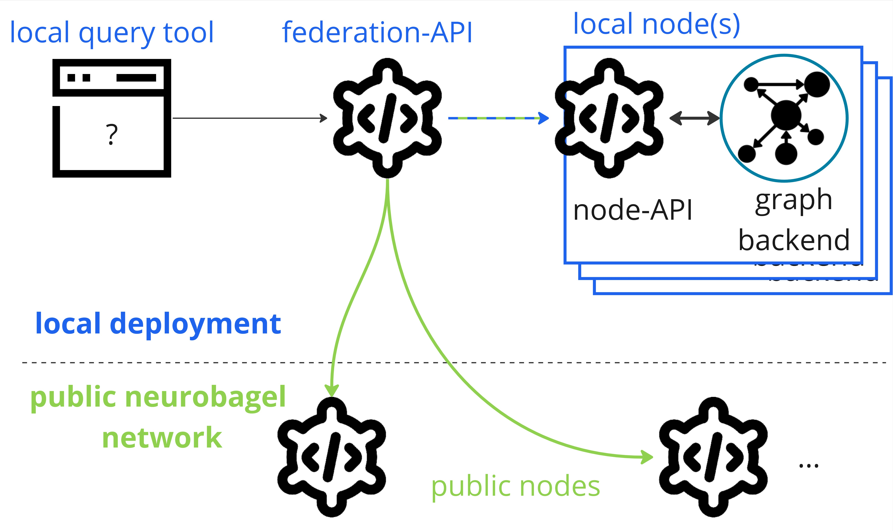

The following sections will get you started
with deploying your own [Neurobagel node](config.md#available-services),
a graphical query tool, 
and a local federation API
(everything in blue in the picture below)
that lets you search across the data in your node and in public Neurobagel nodes.



To prepare your Neurobagel node for production use (i.e., for local or other users),
and to configure your deployment according to your specific needs,
refer to the detailed [Configuration documentation](config.md).

## Requirements

Neurobagel tools are provided as Docker containers 
and are launched with Docker Compose. 

!!! danger "Don't install Neurobagel tools directly on your machine"
    
    Please only use the docker images provided by Neurobagel 
    (or the third party providers Neurobagel relies on) and only launch
    them with our provided `docker-compose.yml` recipe.

    Do not install GraphDB locally on your computer, 
    as doing so can interfere with the deployment of the Neurobagel tools.

### `docker` and `docker compose` 
If you haven't yet, please install both `docker` and `docker compose`
for your operating system:

=== "Linux"

    1. [Install the Docker engine](https://docs.docker.com/engine/install/)
    and [follow the post-setup instructions](https://docs.docker.com/engine/install/linux-postinstall/)
    
    2. [Install Docker Compose using the repository option](https://docs.docker.com/compose/install/linux/#install-using-the-repository)

=== "Windows"

    1. [Install Docker Desktop on Windows](https://docs.docker.com/desktop/install/windows-install/). 
    This will install both `docker` and `docker compose`.

    2. We strongly recommend also [installing Windows Subsystem for Linux](https://learn.microsoft.com/en-us/windows/wsl/install)
    to get a Windows-supported Linux installation for a more seamless Neurobagel deployment experience. 
    Simply follow [these instructions](https://docs.docker.com/desktop/wsl/) to make your existing Docker Desktop installation (including Docker and Docker Compose) available when running WSL.

=== "MacOS"

    [Install Docker Desktop on Mac](https://docs.docker.com/desktop/install/mac-install/).
    This will install both `docker` and `docker compose` automatically.

??? warning "Linux is the only supported OS"

    We test and deploy on Linux and ensure that our
    deployment instructions work on Linux systems.

    We also try to provide docs and help for different architectures,
    but as a small team with limited resources we won't be able to 
    help you debug Operating System specific problems. 

Because we rely on some modern features of these
tools, please make sure you have at least the following
versions on your machine:

- `docker` engine: [v20.10.24](https://docs.docker.com/engine/release-notes/20.10/) or greater
```bash
docker --version
```
- `docker compose`: [v2.0.0](https://github.com/docker/compose/releases/tag/v2.0.0) or above
```bash
docker compose version
```

### The Neurobagel node deployment recipe

The [`neurobagel/recipes` repository](https://github.com/neurobagel/recipes) 
on GitHub contains our official
Docker Compose recipe and template configuration files for setting up a local Neurobagel node.

1. Clone the GitHub repository to your machine and navigate to it
```bash
git clone https://github.com/neurobagel/recipes.git
cd recipes
```
2. Make copies of the template configuration files to edit for your deployment (do not edit the templates themselves)
```bash
cp template.env .env
cp local_nb_nodes.template.json local_nb_nodes.json
```
3. Change `NB_API_QUERY_URL` in the `.env` file 

    You **must** replace the placeholder value for `NB_API_QUERY_URL`in the `.env` file
    
    ```bash
    NB_API_QUERY_URL=http://XX.XX.XX.XX
    ```
    with the address of the machine you are going to deploy Neurobagel on.

    - If you are deploying Neurobagel **for yourself** or just to try things out locally, 
   you can use: `NB_API_QUERY_URL=http://localhost:8080` 
    where `:8080` is the default port for the federation API.
    - If you are deploying Neurobagel on a server for other users, 
   you **must** use the IP (and Port) or URL that your users will access the server with. 
   
!!! info

    This is the minimal configuration you need to make before you can launch Neurobagel.
    In most cases, and especially when you are deploying Neurobagel for other users,
    you will have to make additional configurations. 

    Please refer to [our detailed documentation](config.md#environment-variables) for a complete overview of 
    configuration options.

## Launch Neurobagel

Once you have edited the `.env` and optionally the `local_nb_nodes.json` file, 
you can launch your own Neurobagel node with the following `docker compose` command:

```bash
docker compose --profile full_stack up -d
```

this will:

- pull the required Docker images (if you haven't pulled them before)
- launch the containers for [the Neurobagel services](config.md#available-services) using the `full_stack` [service profile](config.md#available-profiles)
- automatically set up and configure the services based on your configuration files
- automatically upload data to the Neurobagel graph (by default, it will upload an example dataset we have provided for testing)

You can check that your docker containers have launched correctly by running:

```bash
docker ps
```
and you will want to see something like this to show all 4 services running:
```bash
❯ docker ps
CONTAINER ID   IMAGE                              COMMAND                  CREATED         STATUS         PORTS                                                 NAMES
d5e43f9ff0c2   neurobagel/federation_api:latest   "/bin/sh -c 'uvicorn…"   8 seconds ago   Up 8 seconds   0.0.0.0:8080->8000/tcp, :::8080->8000/tcp             recipes-federation-1
f0a26d0ea574   neurobagel/api:latest              "/usr/src/api_entryp…"   8 seconds ago   Up 8 seconds   0.0.0.0:8000->8000/tcp, :::8000->8000/tcp             recipes-api-1
d44d0b7359c8   ontotext/graphdb:10.3.1            "/usr/src/neurobagel…"   8 seconds ago   Up 8 seconds   0.0.0.0:7200->7200/tcp, :::7200->7200/tcp, 7300/tcp   recipes-graph-1
29a61a2d83de   neurobagel/query_tool:latest       "/bin/sh -c 'npm run…"   8 seconds ago   Up 8 seconds   0.0.0.0:3000->5173/tcp, :::3000->5173/tcp             recipes-query_federation-1
```

The `docker-compose.yml` recipe provides additional service profiles
for different deployment use cases (e.g., if you do not need to set up local query federation). Please refer to
our [service profile documentation](config.md#available-profiles) for details.

## Next steps

:tada: You are now the proud owner of a running Neurobagel node. Here are some things you can do now:

- Try the Neurobagel node you just deployed by accessing:
    - your own query tool at  [http://localhost:3000](http://localhost:3000) and reading the [query tool](./query_tool.md) guide
    - the interactive API docs at [http://localhost:8000/docs](http://localhost:8000/docs) and reading the [API](./api.md) guides
- [Prepare your own dataset](./data_prep.md) for annotation with Neurobagel
- [Add your own data to your Neurobagel graph](maintaining.md#updating-the-data-in-your-graph) to search
- Learn about the different [configuration options](config.md) for your Neurobagel node
- Hopefully all went well, but if you are experiencing issues take a look at our [getting help guide](./getting_help.md)