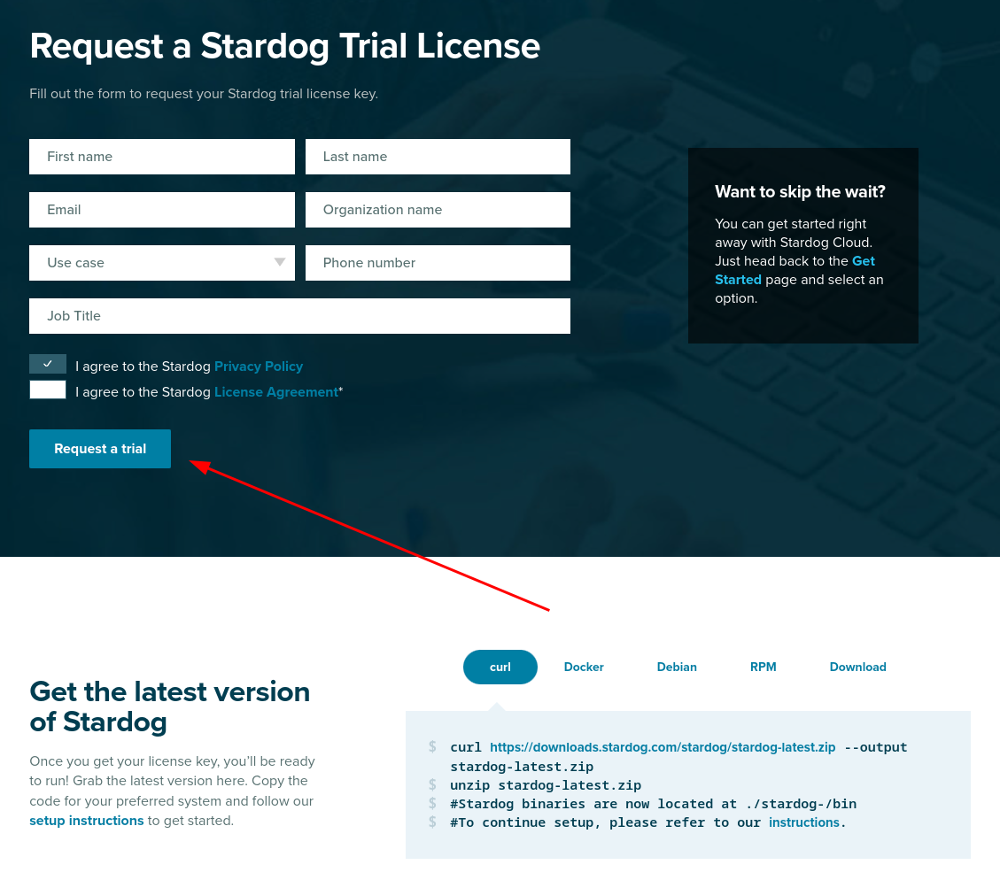

# SysAdmin

These instructions are for a sysadmin looking to deploy Neurobagel locally in an institute or lab.


## Get a license for Stardog

We use Stardog as our graph store application. 
Stardog has a free, annually renewable license for academic use.
In order to make a separate deployment of Neurobagel, 
you should therefore first request your own Stardog license.
You can request a Stardog license here:

[https://www.stardog.com/license-request/](https://www.stardog.com/license-request/)

!!! danger "Don't pick the wrong license"

    Stardog is a company that offers their graph store solutions both as a self-hosted,
    downloadable tool (what we want) and as a cloud hosted subscription model (what we do not want). Both tiers offer free access and the website has a tendency to steer
    you towards the cloud offering. Make sure you request a **license key** for Stardog.



The Stardog license is typically automatically granted via email in 24 hours. 

The license you receive will be a downloadable file. 
It is valid for one year and for a major version of Stardog.
You will need to download the license in a place that is accessible
to your new Stardog instance when it is launched (see below).


## Launch the API and graph stack

We recommend launching the API and your Stardog instance using `docker compose`.
The below steps are distilled from [these instructions](https://github.com/neurobagel/api/blob/main/README.md#local-installation).

### Clone the API repo
```bash
git clone https://github.com/neurobagel/api.git
```

### Set the environment variables
Create a `.env` file in the root of the repository to house the environment variables used by the API-graph network.

The `neurobagel/api` repo contains a [`.template-env`](https://github.com/neurobagel/api/blob/main/.template-env) to get you started. Copy and rename this file to `.env` and then edit it as needed.

Below are all the possible Neurobagel environment variables that can be set in `.env`.

{{ read_table('./api_environment_variables.tsv') }}

_* These defaults are configured for a Stardog backend - you should not have to change them if you are running a Stardog backend._

_** `NB_API_ADDRESS` should not be changed from its default value (`graph`) when using docker compose as this corresponds to the preset container name of the graph database server within the docker compose network._

_&Dagger; See section [Using a graphical query tool to send API requests](#a-note-on-using-a-graphical-query-tool-to-send-api-requests)_

For a local deployment, we recommend to **explicitly set** at least the following variables in `.env`
(note that `NB_GRAPH_USERNAME` and `NB_GRAPH_PASSWORD` must always be set):

- `NB_GRAPH_USERNAME`
- `NB_GRAPH_PASSWORD`
- `NB_GRAPH_DB`
- `NB_GRAPH_IMG`

Note that your Stardog license file must be in the directory specified by `NB_GRAPH_ROOT_HOST` (default `~/stardog-home`).

??? warning "Ensure that shell variables do not clash with `.env` file"
    
    If the shell you run `docker compose` from already has any 
    shell variable of the same name set, 
    the shell variable will take precedence over the configuration
    of `.env`!
    Either unset the local variable or always export the `.env` file first.

    For more information, see [Docker's environment variable precedence](https://docs.docker.com/compose/environment-variables/envvars-precedence/).

To export all the variables defined in your `.env` file in one step, run the following:
```bash
export $(cat .env | xargs)
```

### A note on using a graphical query tool to send API requests
The `NB_API_ALLOWED_ORIGINS` variable defaults to an empty string (`""`) when unset, meaning that your deployed API will only accessible via direct `curl` requests to the URL where the API is hosted (see [this section](#test-the-new-deployment) for an example `curl` request).

However, in many cases you may want to make the API accessible by a frontend tool such as our [browser query tool](https://github.com/neurobagel/query-tool).
To do so, you must explicitly specify the origin(s) for the frontend using `NB_API_ALLOWED_ORIGINS` in `.env`. 

For example, the [`.template-env`](https://github.com/neurobagel/api/blob/main/.template-env) file in the Neurobagel API repo assumes you want to allow API requests from a query tool hosted at a specific port on `localhost`.

Other examples:
```bash
# ---- .env file ----

# do not allow requests from any frontend origins
NB_API_ALLOWED_ORIGINS=""  # this is the default value that will also be set if the variable is excluded from the .env file

# allow requests from only one origin
NB_API_ALLOWED_ORIGINS="https://query.neurobagel.org"

# allow requests from 3 different origins
NB_API_ALLOWED_ORIGINS="https://query.neurobagel.org https://localhost:3000 http://localhost:3000"

# allow requests from any origin - use with caution
NB_API_ALLOWED_ORIGINS="*"
```

**A note for more technical users:** If you have configured an NGINX reverse proxy (or proxy requests to the remote origin) to serve both the API and the query tool from the same origin, you can skip the step of enabling CORS for the API. 
For an example, see https://docs.nginx.com/nginx/admin-guide/web-server/reverse-proxy/.

### Docker Compose

To spin up the Stardog and API containers using Docker Compose, 
ensure that both [docker](https://docs.docker.com/get-docker/) and [docker compose](https://docs.docker.com/compose/install/) are installed.

Run the following in the repository root (where the `docker-compose.yml` file is) to launch the containers:

!!! tip
    Double check that any environment variables you have customized in `.env` are resolved with your expected values using the command `docker compose config`.

```bash
docker compose up -d
```


## Setup for the first run

When you launch the Stardog graph for the first time,
there are a couple of setup steps that need to be done. 
These will not have to be repeated for subsequent starts.

To interact with the Stardog graph, 
you have two general options:

1. Send HTTP request against the HTTP API of the Stardog graph instance (e.g. with `curl`). See [https://stardog-union.github.io/http-docs/](https://stardog-union.github.io/http-docs/) for a full reference of API endpoints
2. Use the free Stardog-Studio web app. See the [Stardog documentation](https://docs.stardog.com/stardog-applications/dockerized_access#stardog-studio) for instruction to deploy Stardog-Studio as a Docker container.


!!! info 
    Stardog-Studio is the most accessible way 
    of manually interacting with a Stardog instance. 
    Here we will focus instead on using the HTTP API for configuration,
    as this allows programmatic access.
    All of these steps can also be achieved via Stardog-Studio manually.
    Please refer to the 
    [official docs](https://docs.stardog.com/stardog-applications/studio/) to learn how.


### Change the database admin password

When you first launch Stardog, 
a default `admin` user with superuser privilege
will automatically be created for you.
This `admin` user is meant to create other database users and modify their permissions.
Do not use `admin` for read and write operations, instead use a [regular database user](#create-a-new-database-user).

You should first change the password of the database `admin`:


```console
curl -X PUT -i -u "admin:admin" http://localhost:5820/admin/users/admin/pwd \
--data '{"password": "NewPassword"}'
```

### Create a new database user

The `.env` file created as part of the `docker compose` setup instructions
declares the `NB_GRAPH_USERNAME` and `NB_GRAPH_PASSWORD` for the database user.
The API will send requests to the graph using these credentials.
When you launch Stardog for the first time, 
we have to create a new database user:

```console
curl -X POST -i -u "admin:NewPassword" http://localhost:5820/admin/users \
-H 'Content-Type: application/json' \
--data '{
    "username": "NewUser",
    "password": [
        "NewUserPassword"
    ]
}'
```

Confirm that the new user exists:

```console
curl -u "admin:NewPassword" http://localhost:5820/admin/users
```

!!! note
    Make sure to use the exact `NB_GRAPH_USERNAME` and `NB_GRAPH_PASSWORD` you
    defined in the `.env` file when creating the new database user.
    Otherwise the API will not have the correct permission
    to query the graph.

### Create new database

When you first launch Stardog,
there are no graph databases.
You have to create a new one to store
your metadata.

If you have defined a custom `NB_GRAPH_DB` name in the `.env` file,
make sure to create a database with a matching name.
By default the API will query a graph database
with a name of `test_data`.

```console
curl -X POST -i -u "admin:NewPassword" http://localhost:5820/admin/databases \
--form 'root="{\"dbname\":\"test_data\"}"'
```

Now we need to give our new database user read and write permission for 
this database:

```console
curl -X PUT -i -u "admin:NewPassword" http://localhost:5820/admin/permissions/user/NewUser \
-H 'Content-Type: application/json' \
--data '{
    "action": "ALL",
    "resource_type": "DB",
    "resource": [
        "test_data"
    ]
}'
```

??? note "Finer permission control is also possible"

    For simplicity's sake, here we give `"ALL"` permission to the new database user.
    The Stardog API provide more fine grained permission control.
    See [the official API documentation](https://stardog-union.github.io/http-docs/#tag/Permissions/operation/addUserPermission).


## Uploading data to the graph

The `neurobagel/api` repo contains a helper script [`add_data_to_graph.sh`](https://github.com/neurobagel/api/blob/main/add_data_to_graph.sh) for automatically uploading all JSONLD files (i.e., graph-ready data) in a directory to a specific graph database, with the option to clear the existing data in the database first.
Each `.jsonld` file is expected to correspond to a single **dataset**.

To view all the command line arguments for add_data_to_graph.sh:
```bash
./add_data_to_graph.sh --help
```

??? info "If you prefer to directly use `curl` requests to modify the graph database instead of the helper script"

    Add a single dataset to the graph database (example)
    ```bash
    curl -u "<USERNAME>: <PASSWORD>" -i -X POST http://localhost:5820/<DATABASE_NAME> \
        -H "Content-Type: application/ld+json" \
        --data-binary @<DATASET_NAME>.jsonld
    ```
    
    Clear all data in the graph database (example)
    ```bash
    curl -u "<USERNAME>: <PASSWORD>" -X POST http://localhost:5820/<DATABASE_NAME>/update \
        -H "Content-Type: application/sparql-update" \
        --data-binary "DELETE { ?s ?p ?o } WHERE { ?s ?p ?o }"
    ```

### Uploading example Neurobagel data
In order to test that the [graph setup steps](#setup-for-the-first-run) worked correctly,
we can add some example graph-ready data to the new graph database.

First, clone the [`neurobagel_examples`](https://github.com/neurobagel/examples) repository:

```bash
git clone https://github.com/neurobagel/neurobagel_examples.git
```

Next, upload the `.jsonld` file in the directory `neurobagel_examples/data-upload/pheno-bids-output` to the database we created above, using `add_data_to_graph.sh`:

!!! info
    Normally you would create the graph-ready files by first [annotating
    the phenotypic information of a BIDS dataset](../annotation_tool) with the 
    Neurobagel annotator, and then [parsing the annotated BIDS
    dataset](../cli) with the Neurobagel CLI.

```bash
./add_data_to_graph.sh PATH/TO/neurobagel_examples/data-upload/pheno-bids-output \ 
  localhost:7200 repositories/my_db/statements NewUser NewUserPassword \
  --clear-data
```
**Note:** Here we added the `--clear-data` flag to remove any existing data in the database (if the database is empty, the flag has no effect).
You can choose to omit the flag or explicitly specify `--no-clear-data` (default behaviour) to skip this step.

### Updating a dataset in the graph database
If the raw data for a previously harmonized dataset (i.e., already has a corresponding JSONLD _which is in the graph_) has been updated, [a new JSONLD file must first be generated for that dataset](updating_dataset.md).
To push the update to the corresponding graph database, our current recommended approach is to simply clear the database and re-upload all existing datasets, including the **new** JSONLD file for the updated dataset.

To do this, rerun `add_data_to_graph.sh` on the directory containing the JSONLD files currently in the graph database, including the replaced JSONLD file for the dataset that has been updated.
**Make sure to include the `--clear-data` flag when running the script so that the database is cleared first.**

## Where to store Neurobagel graph-ready data
To allow easy (re-)uploading of datasets when needed, we recommend having a shared directory in your data filesystem/server for storing Neurobagel graph-ready JSONLD files created for datasets at your institute or lab. 
This directory can be called anything you like, but we recommend an explicit name such as `neurobagel_jsonld_datasets` to distinguish it from the actual raw data files or Neurobagel data dictionaries.
Each `.jsonld` in the directory should include the name of the dataset in the filename.

## Test the new deployment

You can run a test query against the API via a `curl` request in your terminal:

```console
curl -X 'GET' \
  'http://localhost:8000/query/' \
  -H 'accept: application/json'

# or
curl -L http://localhost:8000/query/
```

Or, you can directly use the interactive documentation of the API (provided by [Swagger UI](https://github.com/swagger-api/swagger-ui)) 
by navigating to [http://localhost:8000/docs](http://localhost:8000/docs) in your browser. 
To test the API from the docs interface, expand the `query` endpoint tab with the :fontawesome-solid-chevron-down: icon to view the parameters that can be set, 
and click "Try it out" and then "Execute" to execute a query.

!!! note
    For very large databases, requests to the API using the interactive docs UI may be very slow or time out. 
    If this prevents test queries from succeeding, try setting more parameters to enable an example response from the graph, or use a `curl` request instead.
