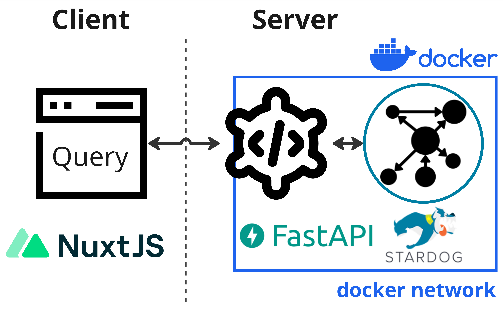

These instructions are for a sysadmin looking to 
deploy a new Neurobagel node locally in an institute or lab. 
A local **neurobagel node** includes the **neurobagel node API** and
a **graph backend** to store the harmonized metadata.

To make searching the neurobagel node easier, 
you can optionally also set up 
a **[locally hosted graphical query interface](#deploy-a-graphical-query-tool).**



Neurobagel uses RDF-triple stores as graph backends.
Because RDF is an W3C open standard, 
any RDF store can be theoretically used as a backend.
We have tested the following options:

!!! warning "Note: Stardog instructions are deprecated"
    Due to Stardog no longer offering free academic licenses for self-hosted graph instances (required for Neurobagel),
    we have deprecated it as a viable graph backend for new Neurobagel nodes. Deployment instructions using Stardog are shown below for legacy reasons, but **please ensure to follow the GraphDB instructions.**

=== "GraphDB"

    [GraphDB](https://graphdb.ontotext.com/) offers a free perpetual license that 
    should be sufficient for most smaller deployments or testing deployments.
    This free license is created automatically when you don't explicitly
    provide a license.

    The free edition mostly offers the same features 
    [as the paid versions](https://www.ontotext.com/products/graphdb/#comparison-table), 
    but restricts the number of concurrent operations
    on the graph to 2. 

    We recommend using GraphDB if these restrictions are not a blocker.

    !!! note
        You do not need to download GraphDB from the official website for the setup steps below.

=== "Stardog"

    **Note: Stardog no longer provides free academic licenses. 
    The below instructions are deprecated and shown only for legacy reasons.**

    [Stardog](https://www.stardog.com/) 
    is a very performant RDF store
    with a large number of extensions. However, it has
    a very restrictive license. We therefore do not recommend
    Stardog for most deployments or testing.

    Stardog has a free, annually renewable license for academic use.
    In order to make a separate deployment of Neurobagel, 
    you should therefore first request your own Stardog license.
    You can request a Stardog license here:

    [https://www.stardog.com/license-request/](https://www.stardog.com/license-request/)

    !!! danger "Don't pick the wrong license"

        Stardog is a company that offers their graph store solutions both as a self-hosted,
        downloadable tool (what we want) and as a cloud hosted subscription model (what we do not want). Both tiers offer free access and the website has a tendency to steer
        you towards the cloud offering. Make sure you request a **license key** for Stardog.

    

    The Stardog license is typically automatically granted via email in 24 hours. 

    The license you receive will be a downloadable file. 
    It is valid for one year and for a major version of Stardog.
    You will need to download the license in a place that is accessible
    to your new Stardog instance when it is launched (see below).

## Launch the Neurobagel node API and graph stack

We recommend launching the Neurobagel API and your graph backend instance using `docker compose`.
(To install the API from source, see [these instructions](https://github.com/neurobagel/api/blob/main/README.md#local-installation).)

### Clone the configuration file templates

The [`neurobagel/recipes`](https://github.com/neurobagel/recipes) repository contains templates of all files needed for configuring different types of Neurobagel deployments.

Configuration files for setting up a single Neurobagel node are found in the [`local_node`](https://github.com/neurobagel/recipes/tree/main/local_node) subdirectory.

```bash
git clone https://github.com/neurobagel/recipes.git
cd recipes/local_node
```

You can follow the next steps directly in this subdirectory, or in a new directory outside of the `recipes` repository.

### Set the environment variables
Create a `.env` file to house the environment variables used by the Neurobagel API-graph network.

The `neurobagel/recipes` repo contains a 
[`template.env`](https://github.com/neurobagel/recipes/blob/main/local_node/template.env)
in [the `local_node` recipe](https://github.com/neurobagel/recipes/tree/main/local_node) 
to get you started. Copy and rename this file to `.env` and then edit it as needed.

Below are all the possible Neurobagel environment variables that can be set in `.env`.

{{ read_table('./repos/recipes/docs/neurobagel_environment_variables.tsv') }}

=== "GraphDB"

    _* These defaults are configured for a GraphDB backend - you should not have to change them if you are running a GraphDB backend._

=== "Stardog"

    _* These values will have to be changed for your deployment from their default value:_

    !!! warning "Change the following default values in your .env file for a Stardog deployment!"

        ```bash
        NB_GRAPH_IMG=stardog/stardog:8.2.2-java11-preview
        NB_GRAPH_ROOT_CONT=/var/opt/stardog
        NB_GRAPH_ROOT_HOST=~/stardog-home  # Or, replace with another directory on your own (host) system where you want to store the database files
        NB_GRAPH_PORT=5820
        NB_GRAPH_PORT_HOST=5820
        NB_GRAPH_DB=test_data/query  # For Stardog, this value should always take the format of: <database_name>/query
        ```

    !!! Note "Your Stardog license file must be in the right directory"

        Note that your Stardog license file must be in the directory specified by `NB_GRAPH_ROOT_HOST` (default `~/stardog-home`).

_** `NB_GRAPH_ADDRESS` should not be changed from its default value (`graph`) when using docker compose as this corresponds to the preset container name of the graph database server within the docker compose network._

_&Dagger; See section [Deploy a graphical query tool](#deploy-a-graphical-query-tool)_


For a local deployment, we recommend to **explicitly set** at least the following variables in `.env`
(note that `NB_GRAPH_USERNAME` and `NB_GRAPH_PASSWORD` must always be set):

> `NB_GRAPH_USERNAME`  
> `NB_GRAPH_PASSWORD`  
> `NB_GRAPH_DB`  
> `NB_GRAPH_IMG`  
> `NB_RETURN_AGG`  
> `NB_API_ALLOWED_ORIGINS`

??? warning "Ensure that shell variables do not clash with `.env` file"
    
    If the shell you run `docker compose` from already has any 
    shell variable of the same name set, 
    the shell variable will take precedence over the configuration
    of `.env`!
    In this case, make sure to `unset` the local variable first.

    For more information, see [Docker's environment variable precedence](https://docs.docker.com/compose/environment-variables/envvars-precedence/).

### Docker Compose

To spin up the Neurobagel API and graph backend containers using Docker Compose, 
ensure that both [docker](https://docs.docker.com/get-docker/) and [docker compose](https://docs.docker.com/compose/install/) are installed.

Run the following in the directory containing both the `docker-compose.yml` file from [the local_nodes recipe](https://github.com/neurobagel/recipes/tree/main/local_node) and the .env file you just created.

!!! tip
    Double check that any environment variables you have customized in `.env` are resolved with your expected values using the command `docker compose config`.

```bash
docker compose up -d
```
Or, to ensure you have the latest Docker images first:
```bash
docker compose pull && docker compose up -d
```

## Setup for the first run

When you launch the graph backend for the first time,
there are a couple of setup steps that need to be done. 
These will not have to be repeated for subsequent starts.

=== "GraphDB"

    The `recipes` repo you cloned contains a script [`graphdb_setup.sh`](https://github.com/neurobagel/recipes/blob/main/scripts/graphdb_setup.sh) which runs the first-time setup steps automatically for GraphDB.

    Run the script as follows 
    (assuming you are in the `recipes/scripts` directory):

    ```bash
    ./graphdb_setup --env-file-path /PATH/TO/.env "NewAdminPassword"
    ```

    Make sure to replace:

    - `/PATH/TO/.env` with the path to the `.env` file you created in the step [Set the environment variables](#set-the-environment-variables)
    - `"NewAdminPassword"` with a secure password of your choice

    The script will:

    1. Set the password of the default `admin` superuser and enable password-based access to databases

        ??? info "Details"

            When you first launch the graph server, a default `admin` user with superuser privilege will automatically be created for you. 
            This `admin` user is meant to create other database users and modify their permissions.
            (For more information, see the [official GraphDB documentation](https://graphdb.ontotext.com/documentation/10.0/devhub/rest-api/curl-commands.html#security-management).)

        ??? example "Doing this manually with `curl`"

            First, change the password for the admin user that has been automatically
            created by GraphDB:

            ```bash
            curl -X PATCH --header 'Content-Type: application/json' http://localhost:7200/rest/security/users/admin -d '
            {"password": "NewAdminPassword"}'
            ```
            (make sure to replace `"NewAdminPassword"` with your own, secure password).

            Next, enable GraphDB security to only allow authenticated users access:
            ```bash
            curl -X POST --header 'Content-Type: application/json' -d true http://localhost:7200/rest/security
            ```

            and confirm that this was successful:
            ```bash
            ➜ curl -X GET http://localhost:7200/rest/security                                                  
            true
            ```

    2. Create a new graph database user based on credentials defined in your `.env` file

        ??? info "Details"
            
            We do not recommend using `admin` for normal read and write operations, instead we can create a regular database user.

            The `.env` file created as part of the `docker compose` setup instructions
            declares the `NB_GRAPH_USERNAME` and `NB_GRAPH_PASSWORD` for the database user.
            The Neurobagel API will send requests to the graph using these credentials.

        ??? example "Doing this manually with `curl`"

            When you launch the RDF store for the first time, 
            we have to create a new database user:

            ```bash
            curl -X POST --header 'Content-Type: application/json' -u "admin:NewAdminPassword" -d '
            {
            "username": "DBUSER",
            "password": "DBPASSWORD"
            }' http://localhost:7200/rest/security/users/DBUSER
            ```

            Make sure to use the exact `NB_GRAPH_USERNAME` and `NB_GRAPH_PASSWORD` you defined in the `.env` file when creating the new database user.
            Otherwise the Neurobagel API will not have the correct permission to query the graph.

    3. Create a new graph database with the name defined in your `.env`

        ??? info "Details"
    
            When you first launch the graph store, there are no graph databases.
            You have to create a new one to store your metadata.

            By default the Neurobagel API will query a graph database named `my_db`. 
            If you have defined a custom `NB_GRAPH_DB` name in the `.env` file, you will first need to create a database with a matching name.

        ??? example "Doing this manually with `curl`"

            In GraphDB, graph databases are called resources.
            To create a new one, you will also have to prepare a `data-config.ttl` file
            that contains the settings for the resource you will create 
            (for more information, see the [GraphDB docs](https://graphdb.ontotext.com/documentation/10.0/devhub/rest-api/location-and-repository-tutorial.html#create-a-repository)).

            You can edit [this example file](https://github.com/neurobagel/recipes/blob/main/scripts/data-config_template.ttl) and save
            it as `data-config.ttl` locally.
            **Ensure the value for `rep:repositoryID`
            in `data-config.ttl` matches the value in
            `NB_GRAPH_DB` in your `.env` file**. 
            For example, if `NB_GRAPH_DB=repositories/my_db`, then
            `rep:repositoryID "my_db" ;`.

            Then, create a new graph database with the following command (replace "my_db" as needed). 
            If your `data-config.ttl` is not in the current directory, replace `"@data-config.ttl"` in the command with `"@PATH/TO/data-config.ttl"`.

            ```bash
            curl -X PUT -u "admin:NewAdminPassword" http://localhost:7200/repositories/my_db --data-binary "@data-config.ttl" -H "Content-Type: application/x-turtle"
            ```

    4. Grant the newly created user from step 2 permissions to access the database

        ??? example "Doing this manually with `curl`"

            ```bash
            curl -X PUT --header 'Content-Type: application/json' -d '
            {"grantedAuthorities": ["WRITE_REPO_my_db","READ_REPO_my_db"]}' http://localhost:7200/rest/security/users/DBUSER -u "admin:NewAdminPassword"
            ```

            - `"WRITE_REPO_my_db"`: Grants write permission.
            - `"READ_REPO_my_db"`: Grants read permission.

            Make sure you replace `my_db` with the name of the graph db you have just created. 

    If the script has run all steps successfully, you should see:
    ```bash
    Done.
    ```

    You can now proceed to the section [Uploading data to the graph](#uploading-data-to-the-graph).

    ??? info "Non-automated options for interacting with the GraphDB backend"

        1. Directly send HTTP requests to the HTTP REST endpoints of the GraphDB backend 
        e.g. using `curl`. GraphDB uses the [RDF4J API](https://rdf4j.org/documentation/reference/rest-api/) specification.
        2. Use the GraphDB web interface (called [the Workbench](https://graphdb.ontotext.com/documentation/10.0/architecture-components.html)), which offers a more accessible way to manage the GraphDB instance. 
        Once your local GraphDB backend is running
        you can connect to the Workbench at [http://localhost:7200](http://localhost:7200).
        The Workbench is well documented on the [GraphDB website](https://graphdb.ontotext.com/documentation/10.0/workbench-user-interface.html).

=== "Stardog"

    **Note: Stardog has been deprecated as a supported Neurobagel graph backend.**

## Updating your graph backend configuration

### Updating existing database user permissions

If you want to change database access permissions (e.g., adding or removing access to a database) for an _existing_ user in your GraphDB instance, you must do so manually.

Of note, in GraphDB, there is no straightforward REST API call to update a user's database access permissions without replacing the list of their existing database permissions (`"grantedAuthorities"`) entirely. 

!!! tip
    You can verify a user's settings at any time with the following:
    ```bash
    curl -u "admin:NewAdminPassword" http://localhost:7200/rest/security/users/DBUSER
    ```

Example: if user `DBUSER` was granted read/write access to database `my_db1` with the following command
(this command is run by default as part of [`graphdb_setup.sh`](https://github.com/neurobagel/recipes/blob/main/scripts/graphdb_setup.sh)):

```bash
curl -X PUT --header 'Content-Type: application/json' -d '
{"grantedAuthorities": ["WRITE_REPO_my_db","READ_REPO_my_db"]}' http://localhost:7200/rest/security/users/DBUSER -u "admin:NewAdminPassword"
```

To grant `DBUSER` read/write access to a second database `my_db2` (while keeping the existing access to `my_db1`), 
you would rerun the above `curl` command with _all_ permissions (existing and new) specified since the existing permissions list will be overwritten:

```bash
curl -X PUT --header 'Content-Type: application/json' -d '
{"grantedAuthorities": ["WRITE_REPO_my_db1","READ_REPO_my_db1", "WRITE_REPO_my_db2","READ_REPO_my_db2"]}' http://localhost:7200/rest/security/users/DBUSER -u "admin:NewAdminPassword"
```

Similarly, to revoke `my_db1` access so `DBUSER` only has access to `my_db2`:

```bash
curl -X PUT --header 'Content-Type: application/json' -d '
{"grantedAuthorities": ["WRITE_REPO_my_db2","READ_REPO_my_db2"]}' http://localhost:7200/rest/security/users/DBUSER -u "admin:NewAdminPassword"
```

??? tip "Managing user permissions using the GraphDB Workbench"

    If you are managing multiple GraphDB databases, the web-based administration interface for a GraphDB instance, the Workbench, 
    might be an easier way to manage user permissions than the REST API.
    More information on using the GraphDB Workbench can be found [here](https://graphdb.ontotext.com/documentation/10.0/workbench-user-interface.html).

### Resetting your GraphDB instance

If you previously set up a Neurobagel node on your machine but want to reset your graph database to start again _from scratch_, 
the most foolproof way would be to start with a clean GraphDB configuration to avoid conflicts with any previously created credentials or databases.

Some examples of when you might want to do this:

- You started but did not complete Neurobagel node setup previously and want to ensure you are using up-to-date instructions and recommended configuration options
- Your local node has stopped working after a configuration change to your graph database (e.g., your Neurobagel node API no longer starts or responds with an error, but you have confirmed all environment variables you have set should be correct)

The configuration for a given GraphDB instance is not tied to a specific GraphDB Docker container, but to the persistent home directory for GraphDB on the host machine.

So, to 'reset' your GraphDB instance for Neurobagel, you need to clear the contents of your persistent GraphDB home directory on your filesystem (this is the path specified for `NB_GRAPH_ROOT_HOST` in your `.env`, which is `~/graphdb-home` by default).

!!! warning

    This action will wipe any graph databases and users you previously created!
    
    We recommend shutting down any Neurobagel services you are currently running (including the graph, API, and query tool containers) before doing this to prevent your services from breaking in unexpected ways.

You can now follow the instructions on this page to (re-)set up your graph database from scratch.

## Uploading data to the graph

The `neurobagel/recipes` repo contains a helper script [`add_data_to_graph.sh`](https://github.com/neurobagel/recipes/blob/main/scripts/add_data_to_graph.sh) in the `scripts` subdirectory for automatically uploading all JSONLD and/or TTL files (i.e., graph-ready data) in a directory to a specific graph database, 
with the option to clear the existing data in the database first.
In the context of Neurobagel, each `.jsonld` file is expected to correspond to a single dataset.

To view all the command line arguments for add_data_to_graph.sh:
```bash
./add_data_to_graph.sh --help
```

In addition to dataset `.jsonld` files, **this script should also be used to add the Neurobagel vocabulary file to each created graph database**, as described in [this section](#adding-vocabulary-files-to-the-graph-database).

??? tip "If you get a `Permission denied` error, add execute permissions to script first"
    ```bash
    chmod +x add_data_to_graph.sh
    ```

??? example "Doing this manually with `curl`"

    === "GraphDB"
        Add a single dataset to the graph database (example)
        ```bash
        curl -u "DBUSER:DBPASSWORD" -i -X POST http://localhost:7200/repositories/my_db/statements \
            -H "Content-Type: application/ld+json" \
            --data-binary @<DATASET_NAME>.jsonld
        ```
        
        Clear all data in the graph database (example)
        ```bash
        curl -u "DBUSER:DBPASSWORD" -X POST http://localhost:7200/repositories/my_db/statements \
            -H "Content-Type: application/sparql-update" \
            --data-binary "DELETE { ?s ?p ?o } WHERE { ?s ?p ?o }"
        ```

    === "Stardog"
        Add a single dataset to the graph database (example)
        ```bash
        curl -u "DBUSER:DBPASSWORD" -i -X POST http://localhost:5820/test_data \
            -H "Content-Type: application/ld+json" \
            --data-binary @<DATASET_NAME>.jsonld
        ```
        
        Clear all data in the graph database (example)
        ```bash
        curl -u "DBUSER:DBPASSWORD" -X POST http://localhost:5820/test_data/update \
            -H "Content-Type: application/sparql-update" \
            --data-binary "DELETE { ?s ?p ?o } WHERE { ?s ?p ?o }"
        ```

### Uploading example Neurobagel data
In order to test that the [graph setup steps](#setup-for-the-first-run) worked correctly,
we can add some example graph-ready data to the new graph database.

First, clone the [`neurobagel_examples`](https://github.com/neurobagel/examples) repository:

```bash
git clone https://github.com/neurobagel/neurobagel_examples.git
```

Next, upload the `.jsonld` file in the directory `neurobagel_examples/data-upload/pheno-bids-output` to the database we created above, using `add_data_to_graph.sh`:

!!! info
    Normally you would create the graph-ready files by first [annotating
    the phenotypic information of a BIDS dataset](../annotation_tool) with the 
    Neurobagel annotator, and then [parsing the annotated BIDS
    dataset](../cli) with the Neurobagel CLI.

=== "GraphDB"
    ``` bash
    ./add_data_to_graph.sh PATH/TO/neurobagel_examples/data-upload/pheno-bids-output \
      localhost:7200 repositories/my_db DBUSER DBPASSWORD \
      --clear-data
    ```

=== "Stardog"
    ``` bash
    ./add_data_to_graph.sh PATH/TO/neurobagel_examples/data-upload/pheno-bids-output \
      localhost:5820 test_data DBUSER DBPASSWORD \
      --clear-data --use-stardog-syntax
    ```

**Note:** Here we added the `--clear-data` flag to remove any existing data in the database (if the database is empty, the flag has no effect).
You can choose to omit the flag or explicitly specify `--no-clear-data` (default behaviour) to skip this step.

??? tip "Tip: Double check the data upload worked by checking the database size"

    === "GraphDB"
        ``` bash
        curl -u "DBUSER:DBPASSWORD" http://localhost:7200/repositories/my_db/size
        ```

    === "Stardog"
        ``` bash
        curl -u "DBUSER:DBPASSWORD" http://localhost:5820/test_data/size?exact=true
        ```

    The number of triples (size) of your database should be > 0.

### Adding vocabulary files to the graph database
??? "Why we need vocabulary files in the graph"
    In the context of an RDF store, in addition to information about specific observations of given standardized concepts such as "subject", "age", and "diagnosis" (represented in the subject-level JSONLDs generated by Neurobagel tools),
    hierarchical relationships between concepts themselves can also be represented.
    Including these relationships in a graph is important to be able to answer questions such as how many different diagnoses are represented in a graph database, to query for higher-order concepts for a given variable, and more.

The participant variables modeled by Neurobagel are named using Neurobagel's own vocabulary (for more information, see this page on [controlled terms](./term_naming_standards.md)).
This vocabulary, which defines internal relationships between vocabulary terms, 
is serialized in the file [`nb_vocab.ttl`](https://github.com/neurobagel/recipes/blob/main/vocab/nb_vocab.ttl) available from the `neurobagel/recipes` repository.
If you have cloned this repository, you will already have downloaded the vocabulary file.

**The `nb_vocab.ttl` file should be added to every created Neurobagel graph database.**
This can be done using the same script we used to upload the dataset JSONLD files, [`add_data_to_graph.sh`](https://github.com/neurobagel/recipes/blob/main/scripts/add_data_to_graph.sh), which adds all `.ttl` and/or `.jsonld` files in a given directory to the specified graph.

Run the following code (assumes you are in the `scripts` subdirectory inside the `recipes` repository):

=== "GraphDB"
    ``` bash
    ./add_data_to_graph.sh ../vocab \
      localhost:7200 repositories/my_db DBUSER DBPASSWORD
    ```

=== "Stardog"
    ``` bash
    ./add_data_to_graph.sh ../vocab \
      localhost:5820 test_data DBUSER DBPASSWORD \
      --use-stardog-syntax
    ```

### Updating a dataset in the graph database
If the raw data for a previously harmonized dataset (i.e., already has a corresponding JSONLD _which is in the graph_) has been updated, [a new JSONLD file must first be generated for that dataset](updating_dataset.md).
To push the update to the corresponding graph database, our current recommended approach is to simply clear the database and re-upload all existing datasets, including the **new** JSONLD file for the updated dataset.

To do this, rerun `add_data_to_graph.sh` on the directory containing the JSONLD files currently in the graph database, including the replaced JSONLD file for the dataset that has been updated.
**Make sure to include the `--clear-data` flag when running the script so that the database is cleared first.**

**After the dataset(s) have been uploaded, ensure that you also re-upload the Neurobagel vocabulary file `nb_vocab.ttl` to the graph database following [this section](#adding-vocabulary-files-to-the-graph-database).**

## Where to store Neurobagel graph-ready data
To allow easy (re-)uploading of datasets when needed, we recommend having a shared directory in your data filesystem/server for storing Neurobagel graph-ready JSONLD files created for datasets at your institute or lab. 
This directory can be called anything you like, but we recommend an explicit name such as `neurobagel_jsonld_datasets` to distinguish it from the actual raw data files or Neurobagel data dictionaries.
Each `.jsonld` in the directory should include the name of the dataset in the filename.

## Test the new deployment

You can run a test query against the Neurobagel API via a `curl` request in your terminal:

```bash
curl -X 'GET' \
  'http://localhost:8000/query/' \
  -H 'accept: application/json'

# or
curl -L http://localhost:8000/query/
```

Or, you can directly use the interactive documentation of the Neurobagel API (provided by [Swagger UI](https://github.com/swagger-api/swagger-ui)) 
by navigating to [http://localhost:8000/docs](http://localhost:8000/docs) in your browser. 
To test the Neurobagel API from the docs interface, expand the `query` endpoint tab with the :fontawesome-solid-chevron-down: icon to view the parameters that can be set, 
and click "Try it out" and then "Execute" to execute a query.

!!! note
    For very large databases, requests to the Neurobagel API using the interactive docs UI may be very slow or time out. 
    If this prevents test queries from succeeding, try setting more parameters to enable an example response from the graph, or use a `curl` request instead.


## Deploy a graphical query tool
To give your users an easy, graphical way to
query your new local neurobagel node,
you have two options:

### As part of local federation
Use this option if any of the following apply! You:

- already have deployed other local neurobagel nodes 
that you want your users to query alongside the new node
- want your users to be able to query 
all public neurobagel nodes together with your new node
- plan on adding more local neurobagel nodes in the
near future that you will want to query alongside your newly created node

In this case, skip directly to the page on
setting up [local query federation](federate.md).

### As a standalone service
Use this option if you

- plan on only deploying a single node
- want your users to only search data
in the new node you deployed

In this case, you need to deploy the query tool
as a standalone docker container.


```bash
docker run -d -p 3000:3000 --env NB_API_QUERY_URL=http://localhost:8000/ --name query_tool neurobagel/query_tool:latest
```

Make sure to replace the value of `NB_API_QUERY_URL` with the `IP:PORT` or domain name of the
new neurobagel node-API you just deployed!

If using the default port mappings for the query tool (`-p 3000:3000` in above command),
you can reach your local query tool at [http://localhost:3000](http://localhost:3000) once it is running.

To verify the exact configuration that your new docker
container is running with (e.g. for debugging),
you can run

```bash
docker inspect query_tool
```

### Updating your Neurobagel API configuration
If deploying the query tool as a standalone service for the local node you have just created, you must ensure the `NB_API_ALLOWED_ORIGINS` variable is correctly set in the [`.env` file configuration for your node API](#set-the-environment-variables). 
The `NB_API_ALLOWED_ORIGINS` variable defaults to an empty string (`""`) when unset, meaning that your deployed Neurobagel API will only be accessible via direct `curl` requests to the URL where the API is hosted (see [this section](#test-the-new-deployment) for an example `curl` request).

To make the Neurobagel API accessible by a frontend tool such as our [browser query tool](https://github.com/neurobagel/query-tool),
you must explicitly specify the origin(s) for the frontend using `NB_API_ALLOWED_ORIGINS` in `.env`.
(Detailed instructions for using the query tool can be found in [Running cohort queries](query_tool.md).)

For example, add the following line to your `.env` file to allow API requests from a query tool hosted at a specific port on `localhost` (see the [Docker Compose section](#docker-compose)).

```bash
NB_API_ALLOWED_ORIGINS="http://localhost:3000 http://127.0.0.1:3000"
```

!!! example "More examples of `NB_API_ALLOWED_ORIGINS`"

    ``` bash title=".env"
    # do not allow requests from any frontend origins
    NB_API_ALLOWED_ORIGINS=""  # this is the default value that will also be set if the variable is excluded from the .env file

    # allow requests from only one origin
    NB_API_ALLOWED_ORIGINS="https://query.neurobagel.org"

    # allow requests from 3 different origins
    NB_API_ALLOWED_ORIGINS="https://query.neurobagel.org https://localhost:3000 http://localhost:3000"

    # allow requests from any origin - use with caution
    NB_API_ALLOWED_ORIGINS="*"
    ```

After updating the `.env` file, run the following commands to relaunch your node API with your changes:
```bash
docker compose down
docker compose up -d
```

??? note "For more technical deployments using NGINX"

    If you have configured an NGINX reverse proxy (or proxy requests to the remote origin) to serve both the Neurobagel API and the query tool from the same origin, you can skip the step of enabling CORS for the API. 
    For an example, see https://docs.nginx.com/nginx/admin-guide/web-server/reverse-proxy/.