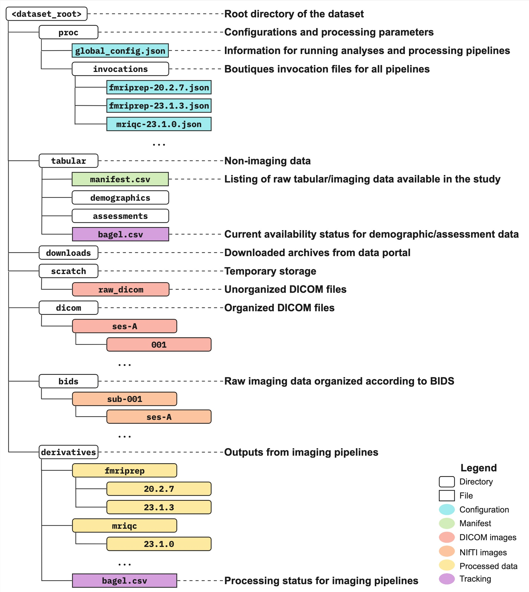

## Data organization

---

---

### TODO

- Scanner DICOM files are named and stored in various formats and locations. In this step we extract, copy, and rename DICOMs in a single directory for all participants with available imaging data. 
    - Copy / download all "raw dicoms" in the `<DATASET_ROOT>/scratch/raw_dicoms` directory.
    - Write a script to extract, copy, and rename these raw DICOMs into `<dataset>/dicom`. Ensure `participant_id` naming matches with `participants.csv` in `<DATASET_ROOT>/tabular/demographics` 
- Copy a single participant (i.e. dicom dir) into `<DATASET_ROOT>/test_data/dicom`. This participant will serve as a test case for various pipelines. 

