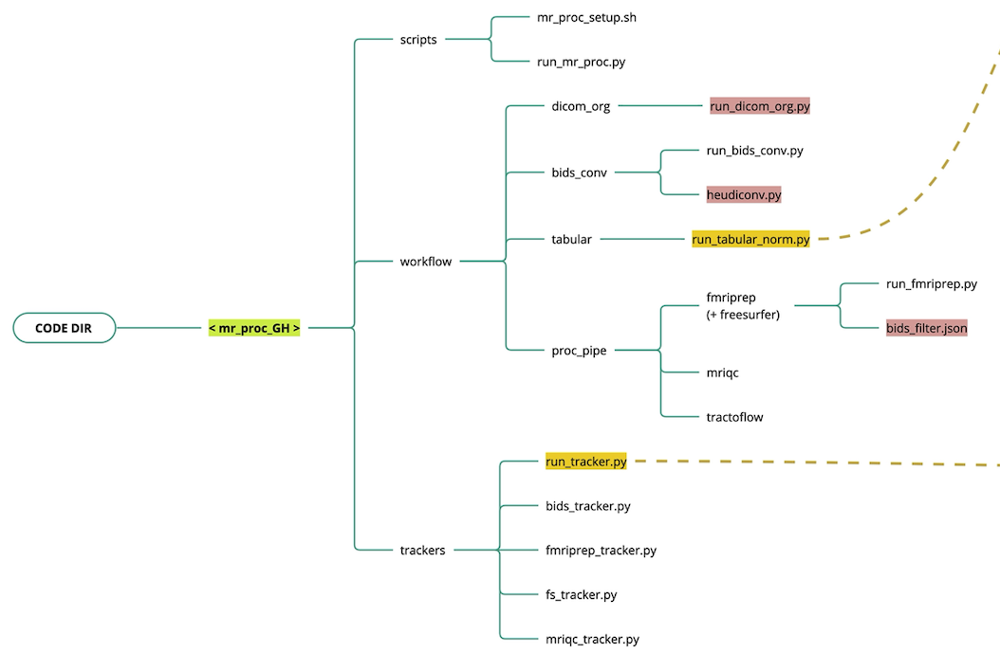

## Data organization

---

mr_proc dataset consists of a specific directory structure to organize MRI and tabular data

---

Directories: 

- `tabular`
    - `demographics`: contains `mr_proc_manifest.csv`
    - `assessments`: contains clinical assessments (e.g. MoCA) 
- `downloads`: data dumps from remote data-stores (e.g. LONI)
- `scratch`: space for un-organized data and wrangling
- `dicom`: participant-level dicom dirs
- `bids`: BIDS formatted dataset
- `derivatives`: output of processing pipelines (e.g. fmriprep, mriqc)
- `proc`: space for config and log files of the processing pipelines
- `backups`: data backup space (tars)
- `releases`: data releases (symlinks)

