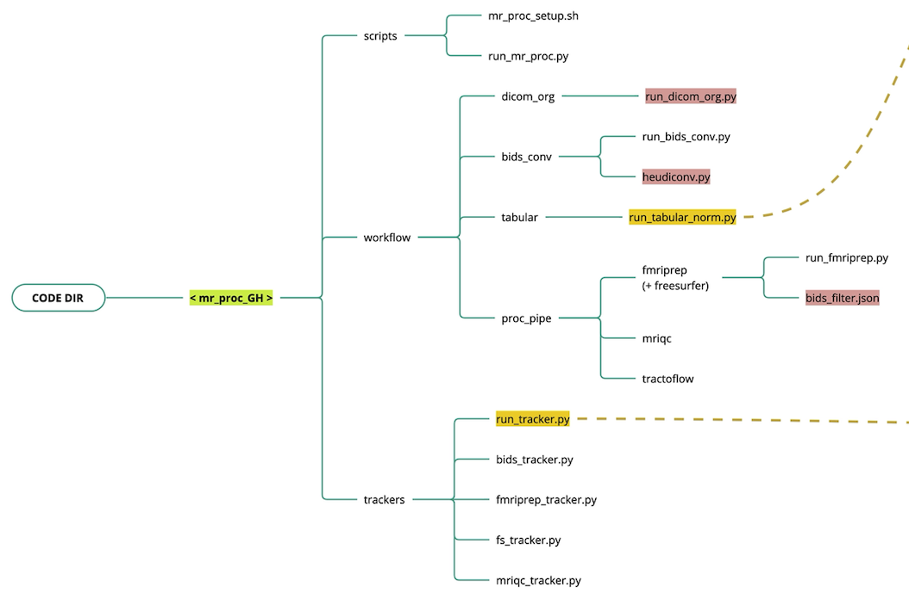



## Code organization

---

The Nipoppy codebase is divided into data processing `workflows` and data availability `trackers`.

---

**`workflow`**

- MRI data organization ([`dicom_org`](./workflow/dicom_org.md) and [`bids_conv`](./workflow/bids_conv.md))
    - Custom script to organize raw DICOMs (i.e. scanner output) into a flat participant-level directory. 
    - Convert DICOMs into BIDS using [Heudiconv](https://heudiconv.readthedocs.io/en/latest/)
- MRI data processing (`proc_pipe`)
    - Runs a set of containerized MRI image processing pipelines 
- Tabular data (`tabular`)
    - Custom scripts to organize raw tabular data (e.g. clinial assessments)
    - Custom scripts to normalize and standardize data and metadata for downstream harmonization (see [NeuroBagel](../index.md))

**`trackers`**

- Track available raw, standardized, and processed data
- Generate `bagels` for Neurobagel graph and dashboard. 

--- 

*Legend*
- Red: dataset-specific code and configuration files
- Yellow: Neurobagel interface

