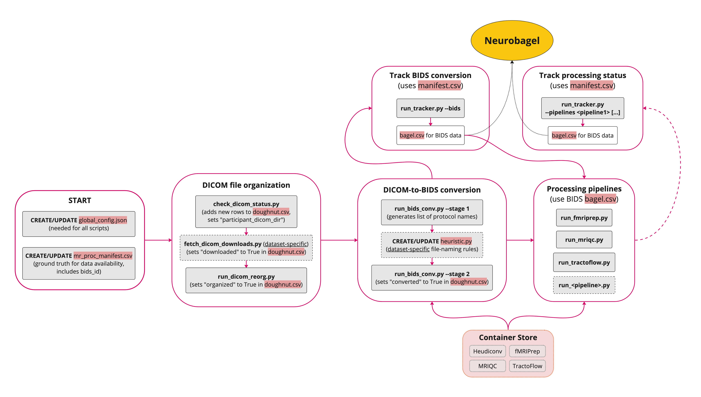

## What is Nipoppy? 

[*Process long and prosper*](https://en.wikipedia.org/wiki/Vulcan_salute)

[Nipoppy](https://github.com/neurodatascience/nipoppy) is a lightweight framework for analyzing (neuro)imaging and clinical data. It is designed to help users do the following:

1. Curate and organize data into a standard directory structure
2. Run data processing pipelines in a semi-automated and reproducible way
3. Track availability (including processing status, if applicable) of raw, tabular and derived data
4. Extract imaging features from MRI derivatives data for downstream analysis

### Example workflow

Given a dataset to process, a typical workflow with Nipoppy can look like this:

1. Fork the [Nipoppy template code repository](https://github.com/neurodatascience/nipoppy), then clone it
    * This repository contains scripts to run processing pipelines (and track their results) on BIDS data
2. Standardize raw imaging data: convert raw DICOM files into the NIfTI format and organize the dataset according to the [BIDS standard](https://bids-specification.readthedocs.io/en/stable/)
    * This requires some custom scripts, including the [`heuristic.py` file for HeuDiConv](https://heudiconv.readthedocs.io/en/latest/heuristics.html)
3. Run commonly-used image processing pipelines
    * Nipoppy currently supports [FreeSurfer](https://surfer.nmr.mgh.harvard.edu/), [fMRIPrep](https://fmriprep.org/en/stable/), [TractoFlow](https://tractoflow-documentation.readthedocs.io/en/latest/), and [MRIQC](https://mriqc.readthedocs.io/en/stable/) out-of-the-box, but new pipelines can be added by the user if needed
4. Organize demographic and clinical assessment data
    * This will most likely involve some custom data wrangling, for example to combine clinical assessment scores into a single file
5. Run tracker scripts to determine the availability of imaging (raw and/or processed) and/or tabular data
    * We call these availability/status metadata files "bagels" because they can be ingested by [Neurobagel](https://www.neurobagel.org/) for [dashboarding](https://digest.neurobagel.org/) and [querying](https://query.neurobagel.org/) participants across multiple studies

## Who is Nipoppy for?

Anyone who wants to process datasets with imaging data and/or use datasets processed with Nipoppy.

**Data managers**

* People who process datasets, either for specific analyses or to share with others
* Example use cases:
    * Data curation
        * Download/organize raw DICOM files
        * Convert raw data to a BIDS directory structure
        * Organize clinical data
    * Data processing
        * Run pre-existing processing pipelines
        * Add scripts to run custom pipelines
        * Do cross-dataset processing: running the same pipelines/versions on different datasets so that the outputs can be used together
    * Data tracking
        * Check processing failures and relaunch processing
        * Generate bagel files for Neurobagel

**Data users**

* People who use tabular, derivative or other files produced by Nipoppy (e.g., from a shared Nipoppy-compliant dataset)
* Example use cases:
    * Data querying
        * Check availability of raw and/or derived data
        * Check which pipelines and version have been run
    * Data analysis
        * Extract imaging features for downstream analyses from specific pipelines/versions

## How does Nipoppy work?

### Modules

1. `Code`: Codebase [repo](code_org.md) for running and tracking workflows
    * The codebase should start from the [Nipoppy template repository](https://github.com/neurodatascience/nipoppy). Additional custom scripts need to be added to process specific datasets.
2. `Data`: [Dataset](data_org.md) organized in a specific directory structure
    * This contains the data only and should not contain any code
3. `Containers`: [Singularity/Apptainer](https://apptainer.org/) containers encapsulating processing pipelines

### Organization
Organization of `Code`, `Data`, and `Container` modules

### Steps
The Nipoppy workflow steps and linked identifiers (i.e. `participant_id`, `dicom_id`, `bids_id`) are shown below:

## FAQ

1. Do I need to install anything to use Nipoppy?
    * Nipoppy requires Python 3 and [Apptainer/Singularity](https://apptainer.org/) to work.
2. Can Nipoppy process my entire dataset out-of-the-box?
    * No: every dataset is different, and it is virtually impossible to have a workflow flexible enough to work with any dataset format or structure. However, once the imaging data is converted to a standard BIDS structure, running the image processing pipelines should be very straightforward.
3. Do I need to follow all the steps listed in the [example workflow](#example-workflow)?
    * No: the purpose of the example workflow is to illustrate what can be done with Nipoppy, but you can choose to only use it for specific features (e.g., tracking).
4. Can I run Nipoppy scripts in Windows/macOS?
    * Nipoppy is designed to run on the Linux operating system, and will likely not work on other operating systems. This is mainly because it relies on Singularity, which [cannot run natively on Windows or macOS](https://apptainer.org/docs/admin/main/installation.html#installation-on-windows-or-mac). It is probably possible to use Nipoppy with Windows/macOS (e.g., using virtual machines), but we do not recommend it.
5. Can I use Nipoppy on a cluster?
    * Yes, as long as the cluster has [Apptainer/Singularity](https://apptainer.org/) installed
6. Do I need to know how to use [Apptainer/Singularity](https://apptainer.org/)?
    * The Nipoppy code repo contains scripts that call Singularity to run image processing pipelines. Users are not required to use Singularity directly, though we encourage users to learn about containers and/or Singularity if they are not familiar with these terms.
7. I want to use Nipoppy with my own pipeline. Does it need to be containerized?
    * Although we recommend the use of containers to facilitate reproducibility, it is not a strict requirement. You can run your own pipelines any way you want (on the BIDS data or even raw data), though the outputs should be organized in the same way as the other pipelines (fMRIPrep, TractoFlow, etc.) if you want to use the tracking features.
8. What is [Neurobagel](https://www.neurobagel.org/) and do I need to use it?
    * Neurobagel is a data harmonization project that includes tools to perform cross-datasets searches for imaging data availability. You do not need Neurobagel for Nipoppy, though some Nipoppy outputs (specifically the `bagel` tracking files) can be used as input to some Neurobagel tools.
9. How do I use the dashboard?
    * Simply visit [https://digest.neurobagel.org](https://digest.neurobagel.org) (no installation required). More information about the dashboard can be found [here](https://github.com/neurobagel/digest).
