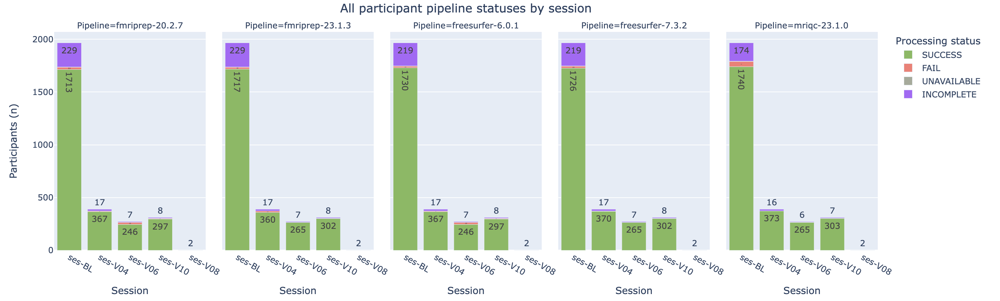

## Track data availability status

---

Trackers check the availability of files created during the dataset processing workflow (specifically the BIDS raw data and imaging pipeline derivatives) and assign an availability status (`SUCCESS`, `FAIL`, `INCOMPLETE` or `UNAVAILABLE`).

---

### Key directories and files

- `<DATASET_ROOT>/bids`
- `<DATASET_ROOT>/derivatives`
- `<DATASET_ROOT>/derivatives/bagel.csv`

### Running the tracker script

The tracker uses the `manifest.csv` and `doughnut.csv` files to determine the participant-session pairs to check. Each available tracker has an associated configuration file (typically called `<pipeline>_tracker.py`), where lists of expected paths for files produced by the pipeline are defined.

For each participant-session pair being tracked, the tracker outputs a `"pipeline_complete"` status. Depending on the configuration for that particular pipeline, the tracker might also output phase and/or stage statuses (e.g., `"PHASE__func"`), which typically refer to sub-pipelines within the full pipeline that may or may not have been run during processing, depending on the input data and/or processing parameters.

The tracker script updates the tabular `<DATASET_ROOT>/derivatives/bagel.csv` file (see the [Understanding the `bagel.csv` output](#understanding-the-bagelcsv-output) for more information).

> Sample command:
```bash
python nipoppy/trackers/run_tracker.py \
    --global_config <global_config_file>
    --dash_schema nipoppy/trackers/bagel_schema.json
    --pipelines fmriprep mriqc tractoflow heudiconv
```

Notes:
- Currently available image processing pipelines are: `fmriprep`, `mriqc`, and `tractoflow`. See [Adding a tracker](#adding-a-tracker) for the steps to add a new tracker.
- Use `--pipelines heudiconv` for tracking BIDS data availability
- An optional `--session_id` parameter can be specified to only track a specific session. By default, the trackers are run for all sessions.
- Other optional arguments include `--run_id` and `--acq_label`, to help generate expected file paths for BIDS Apps.

### Understanding the `bagel.csv` output

A JSON schema for the `bagel.csv` file produced by the tracker script is available [here](https://github.com/neurobagel/digest/blob/main/schemas/bagel_schema.json).

Here is an example of a `bagel.csv` file:

| bids_id | participant_id | session | has_mri_data | pipeline_name | pipeline_version | pipeline_starttime | pipeline_complete |
| ------- | -------------- | ------- | ------------ | ------------- | ---------------- | ------------------ | ----------------- |
| sub-MNI001 | MNI001 | 1 | TRUE | freesurfer | 6.0.1 | 2022-05-24 13:43 | SUCCESS |
| sub-MNI001 | MNI001 | 2 | TRUE | freesurfer | 6.0.1 | 2022-05-24 13:46 | SUCCESS |
| sub-MNI001 | MNI001 | 3 | TRUE | freesurfer | 6.0.1 | UNAVAILABLE | INCOMPLETE |

The imaging derivatives bagel has one row for each participant-session-pipeline combination. The pipeline status columns are `"pipeline_complete"`, and any column whose name begins by `"PHASE__"` or `"STAGE__"`. The possible values for these columns are:
- `"SUCCESS"`: All expected pipeline output files (as configured by pipeline tracker) are present.
- `"FAIL"`: At least one expected pipeline output is missing.
- `"INCOMPLETE"`: Pipeline has not been run for the subject session (output directory missing).
- `"UNAVAILABLE"`: Relevant MRI modality for pipeline not available for subject session (determined by the `datatype` column in the dataset's manifest file).

### Adding a tracker

1. Create a new file in `nipoppy/trackers` called `<new_pipeline>_tracker.py`.
2. Define a config dictionary `tracker_configs`, with a mandatory key `"pipeline_complete"` whose value is a function that takes as input the path to the subject result directory, as well as the session and run IDs, and outputs one of `"SUCCESS"`, `"FAIL"`, `"INCOMPLETE"`, or `"UNAVAILABLE"`. See the built-in [fMRIPrep tracker](https://github.com/neurodatascience/nipoppy/blob/main/nipoppy/trackers/fmriprep_tracker.py) for an example.
3. Optionally add additional stages and phases to track. Again, refer to the [fMRIPrep tracker](https://github.com/neurodatascience/nipoppy/blob/main/nipoppy/trackers/fmriprep_tracker.py) for to any other pre-defined tracker configuration for an example.
4. Modify `nipoppy/trackers/run_tracker.py` to add the new tracker as an option.

### Visualizing availability status with the Neurobagel [`digest`](https://digest.neurobagel.org/)

The `bagel.csv` file written by the tracker can be uploaded to [https://digest.neurobagel.org/](https://digest.neurobagel.org/) (as an "imaging CSV file") for interactive visualizations of processing status.


