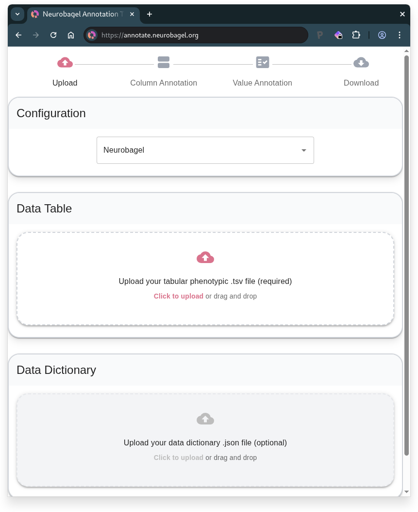
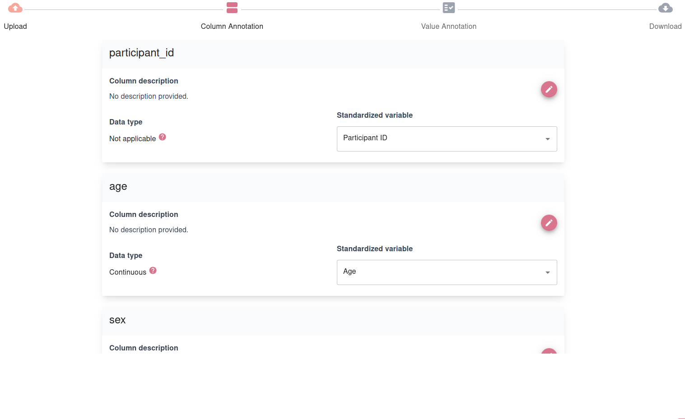
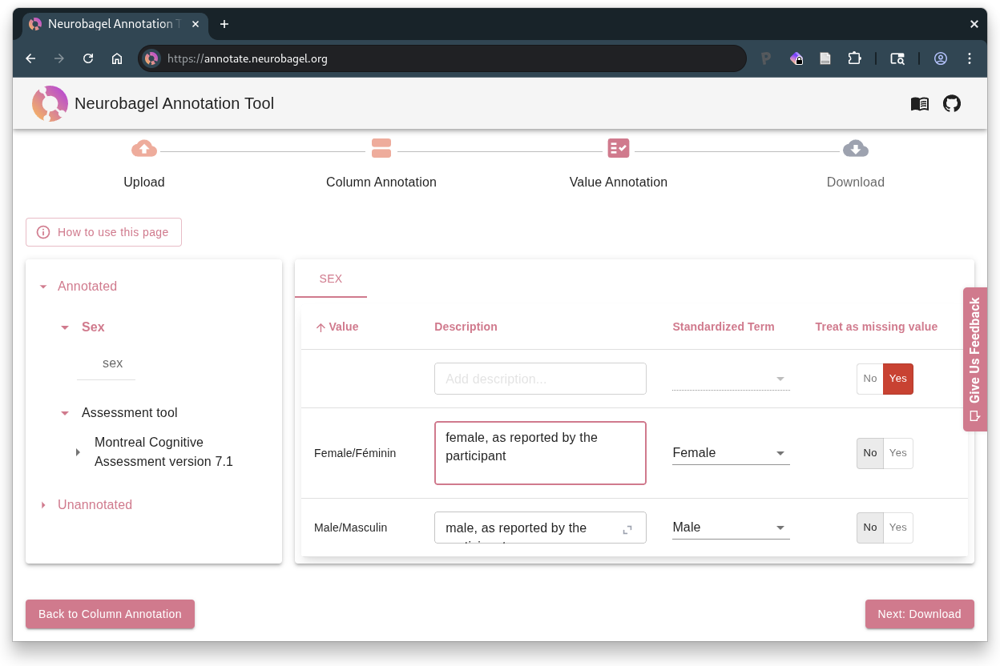
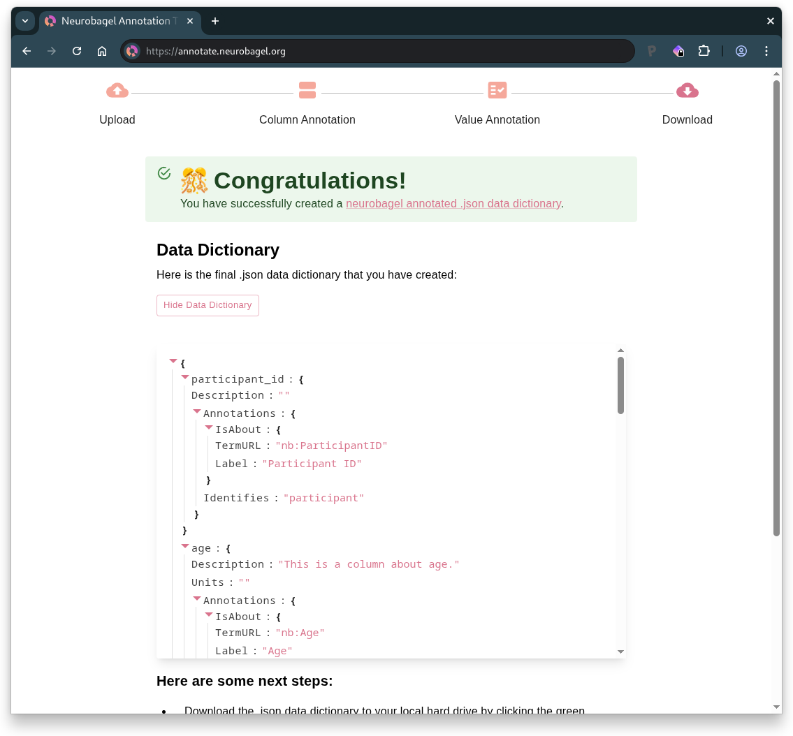

# The Neurobagel Annotation Tool

The Neurobagel annotation tool creates standardized, machine-readable data dictionaries for tabular data using curated FAIR vocabularies. The tool helps to harmonize tabular research data and is compatible with BIDS datasets.

**Workflow summary**: 

1. Upload table
2. Annotate columns
3. Annotate values
4. Download dictionary

### 1. Upload

- **Upload your [data table](data_prep.md)** (.tsv file)
    - Can be `participants.tsv` from a BIDS dataset
- **Optional**: Upload an existing data dictionary (.json file) for extra context
   - Can use `participants.json` from BIDS datasets
   - Or continue previous Neurobagel annotation work

In the following steps you annotate your table by first describing the columns and then the values within these columns.

### 2. Column Annotation

Each column in your uploaded table is represented as a card on this page. For each column, you can:

- **Add a description** - Click "Edit" to describe what the column contains
- **Select the data type** - Choose "Categorical" for discrete values or "Continuous" for numerical measurements
- **Select the standardized variable that best describes the column from the dropdown** (if a suitable match exists)
   - Neurobagel can harmonize certain variables used to describe subject phenotypic information (e.g., "Age", "Sex", "Diagnosis", "Assessment tool")
   - **Note:** A data type will be inferred for the column automatically once a standardized variable is selected

!!! tip "When to manually select data type"
    We recommend manually selecting the data type ("Categorical" or "Continuous") in two cases:
        1. If your column doesn't match any standardized variable
        2. If your column matches the "Assessment tool" standardized variable (which does not have a predefined data type since it can represent multi-column measures)
   

**Note:** This step will only be available if you have mapped columns in your data table to the "Assessment tool" standardized variable.

On this page, 

- Create a card for each assessment that you want to annotate by
    - clicking the :fontawesome-solid-circle-plus: icon and
    - selecting the name of the assessment from the dropdown list.
    - If no suitable match exists, 
        - this likely means that the available standardized vocabulary cannot currently represent your assessment. 
        - to avoid incomplete annotations, un-map the column(s) corresponding to the missing assessment from the "Assessment tool" standardized variable using the :fontawesome-solid-xmark-circle: button in the card on the right.
- Group the columns that describe same instrument by
  - selecting them from the dropdown on the respective assessment card
  - Each column can only be mapped to one assessment card
  - You can see the remaining, ungrouped columns in the overview on the right

### 3. Value Annotation

The left sidebar displays the standardized variables that are represented in your tabular data, along with the column names that have been mapped to those variables.

Click on a standardized variable (or data type, for unannotated columns) subheading in the sidebar to display the columns corresponding to that variable (or data type). 
Then, in the resulting column-level view on the right, navigate between the column tabs to annotate the values within each column.

!!! note "Understanding sidebar sections"
    The sidebar organizes your columns by their annotation progress: 
        - **Annotated** contains columns you have mapped to standardized variables
        - **Unannotated** contains columns you have not mapped to a standardized variable
            - Within this section, unannotated columns are organized based on whether you have assigned them a data type

#### Columns with continuous data

For a column containing continuous data, you can:

- Add a description of the units of measurement
- Select the format of the numerical values 
- Select "Mark as missing" for any values that represent missing, unavailable, or invalid data (the column-level view will only display unique values in the column)

!!! info "Units vs. Format"
    **Format** refers to how the numbers in your data are structured (e.g., "float" for decimal numbers like 25.5, "int" for whole numbers like 25) whereas **Units** describe what the numbers represent (e.g., "years" for age, "points" for test scores, "mg/dL" for measurements).

#### Columns with categorical data

For a column containing categorical data, you will be prompted to annotate the unique values detected in the column.
This includes any values that are blank (empty strings) or contain only whitespace.

For each unique column value, you can:

- Add a free-form description of the value
- Select a standardized term that best captures the meaning of the value
- Select "Mark as missing" if the value:
     - indicates missing, unavailable, or invalid data
     - OR, does not have a suitable match among the standardized term options

### 4. Download

- **Preview** your annotated data dictionary
- **Download** your completed file
- **Start over** with "Annotate New Dataset" if needed

Your downloaded data dictionary is BIDS-compatible and, if you see the confirmation that you have successfully created a Neurobagel data dictionary, it is ready to be used to [generate data for a Neurobagel graph database](https://neurobagel.org/user_guide/cli/).
