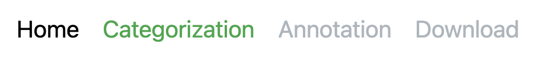
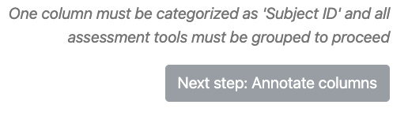
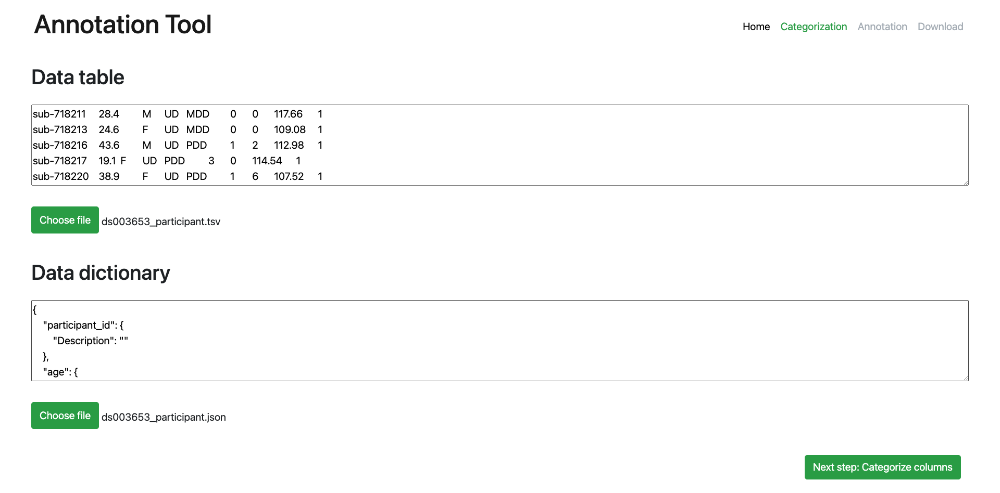
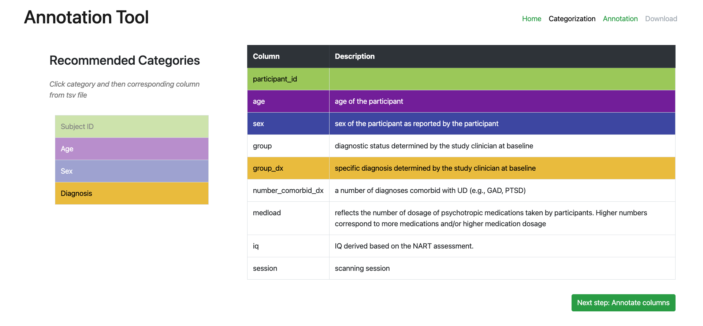
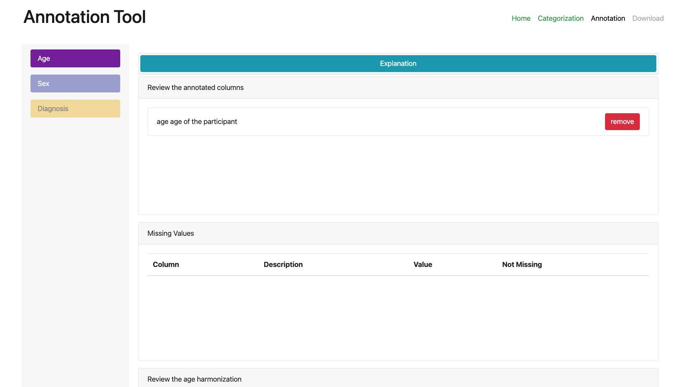
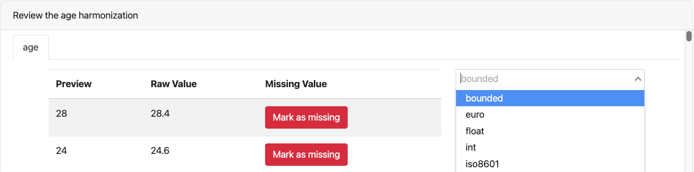
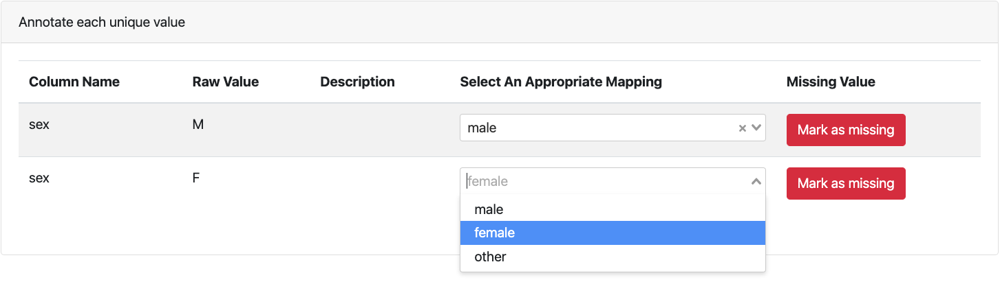
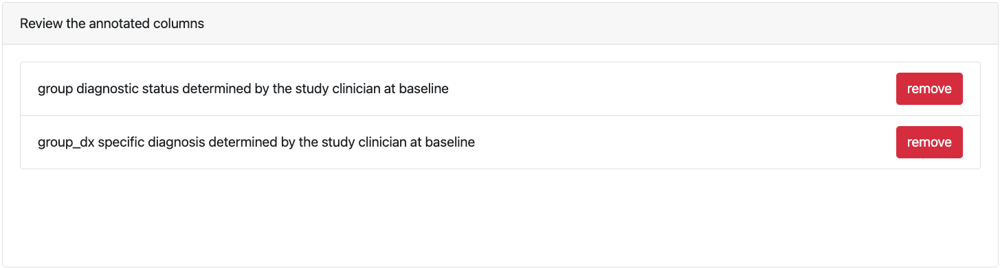

# The Neurobagel Annotation Tool

Neurobagel's annotation tool takes BIDS-style [phenotypic data](https://github.com/neurobagel/annotation_tool/blob/master/cypress/fixtures/examples/good/ds003653_participant.tsv) and [corresponding data description files](https://github.com/neurobagel/annotation_tool/blob/master/cypress/fixtures/examples/good/ds003653_participant.json) and gives users the ability to annotate their data using the Neurobagel data model for preparation to inject that modeled data into Neurobagel's graph database for [federated querying](https://github.com/neurobagel/query-tool).

The annotation tool is a Vue application, developed in [JavaScript](https://www.javascript.com/) using a variety of tools including [Nuxt](https://nuxtjs.org/), [Cypress](https://www.cypress.io/), and [BootstrapVue](https://bootstrap-vue.org/docs).

## Quickstart

The demo version of the annotation tool is hosted at [https://annotate.neurobagel.org/](https://annotate.neurobagel.org/).

## Local Installation

### Building and running

```bash
# First, clone the repository at https://github.com/neurobagel/annotation_tool

# Install dependencies
$ npm install

# Serve with hot reload at localhost:3000
$ npm run dev

# Build for production and launch server
$ npm run build
$ npm run start

# Generate static project
$ npm run generate
```
### Deployment

To deploy the static build on GH pages, run

```bash
npm run generate
npm run deploy
```

See the [Nuxt documentation](https://nuxtjs.org/deployments/github-pages/) for more details.

### Developer information

**use node v16.x LTS**!

:warning: 
The Annotation Tool is built with the Nuxt framework and currently depends on Nuxt2. 
Nuxt2 does not support node versions beyond the v16 LTS (see e.g. [this Github issue](https://github.com/nuxt/nuxt/issues/10844)).
If you want to run the tool locally, make sure you are using node v16.x.
A good way to manage different node versions is to use the [node version manager](https://github.com/nvm-sh/nvm) tool.

## Annotation Workflow

1. Upload data table (and/or data dictionary)
2. Linking columns you want annotated with Neurobagel metadata categories
3. Annotate the values of the those categirzed columns
4. Download an annotated version of a BIDS-style data dictionary for your dataset

## General Navigation

<!--
NOTE: Raw HTML is used for this set of images as in the README to restrict screenshot size, but mkdocs doesn't play well with the relative path links (see https://github.com/mkdocs/mkdocs/issues/991), so the paths have been modified to start with `../` instead of `./` so mkdocs can find the right files.
-->
{ width="300"}
{ width="300"}

There are two means of moving forward to the next step in the annotation tool's workflow: (1) the <span style="color:green;">navbar</span> at the top right of the screen which features the page names, and (2) the <span style="color:green;">next page buttons</span> on the bottom right of each page.

{ width="300"}

However, special criteria for each page need to be be met in order to move forward. Instructions are offered above the <span style="color:green;">next page button</span> while those conditions are still as of yet unmet. (These are denoted below under _Next page criteria_.) After having done so, the next page's name in the <span style="color:green;">navbar</span> will turn from gray to green, and the <span style="color:green;">next page button</span> will turn from gray to green as well.

## Page Instructions

### Home (Upload) page

The Home page is where you can upload data tables and dictionaries either for a brand new annotation or to continue a previous annotation session.



#### Selecting a data table (participants.tsv)

1. Click the 'Choose File' button in the 'Data Table' section of the page to upload the BIDS-style phenotypic data file you wish to annotate. (One typical name for this file is `participants.tsv`.)
2. Once uploaded a preview of the tsv file will be shown in the 'Data Table' text box. You may want to examine the preview contents in the text box to ensure you have uploaded the file that you expect to be annotating.

While the annotation tool does not transform data with annotations, it will link the columns found in the uploaded tsv file to categories Neurobagel's metadata schema. Which columns the tool links is up to you on the next page: the categorization page.

#### Selecting a data dictionary (optional) (participants.json)

1. In order to upload your data dictionary, a data table must be uploaded first. This allows the annotation tool to understand the full structure of your data and the add its own entries for annotation purposes to a new, enhanced version of the data dictionary you will be uploading.
2. Click the now-enabled 'Choose File' button in the 'Data Dictionary' section of the page to uploads the BIDS-style data dictionary.
3. Once uploaded a preview of the json file will be shown in the 'Data Dictionary' text box. You may want to examine the preview contents in the text box to ensure you have uploaded the file that you expect to be annotating.

_Next page criteria:_ A `participants.tsv` file must be uploaded to proceed to categorization of that dataset's columns

### Categorization page

The Categorization page is where you link the columns in your data table to the categories found in Neurobagel's metadata schema. Current categories include 'Subject ID', 'Age', 'Sex' and 'Diagnosis'. Aside from the 'Subject ID' which is a special case, categories represent different data types, 'Sex' and 'Diagnosis' are categorical while 'Age' is continuous.



#### Categorizing data table columns

1. Select a category in the category selection component on the left.
2. Select a column from your uploaded `participants.tsv` in the table on the right. (Its description from your `participants.json` - if uploaded - will be seen here as well.) This will paint the column's table row with the same color as the category you have selected. This column is now linked to that category and you will be able to annotate its values on the annotation page.

_Next page criteria:_ A column must be annotated as holding a 'Subject ID', and at least one other column must be linked with one of the other categories

### Annotation page

The Annotation page is where you can annotate the values in your uploaded `participants.tsv`. The Neurobagel categories which you have linked columns to on the previous Categorization page are listed as tabs on the left.

* Clicking on each category tab will allow you to use the interface to annotated the values of each categorized column.
* When multiple columns have been linked with a category, each column will have its own column in the annotation components on the page.
* Any value in the annotation interface can be marked as a 'missing value' (i.e. `'N/A'`, empty string, etc.)



#### Age rows (continuous values)



All values for columns categorized as `Age` can be annotated here with a set of continuous value transformations. Clicking on the dropdown will allow you to select a transformation. Current transformations available include `bounded`, `euro`, `float`, `int`, and `iso8601`. The raw values from the column are shown and when a transformation type is selected a preview of how that transformation would alter each raw value is shown.

#### Sex and Diagnosis rows (categorical values)

All values for columns categorized as either `Sex` or `Diagnosis` can be annotated here with labels that come from Neurobagel and the controlled vocabularies it utilizes to help form the Neurobagel metadata model. Clicking on the drop down on each raw value row will allow you to select an appropriate Neurobagel label for this value.



#### Missing values

Any continuous or categorical value can be marked as 'missing' via the adjacent `Mark as missing` button. This will remove the value from the annotatable values and place it in the `Missing values` section on the page. This can be undone for any value by clicking the `Not Missing` button in this section of the page.


#### Unlinking columns

Data table columns can also be unlinked (e.g. un-categorized) on the Annotation page in this section of the page labeled `Review the annotated columns`. This will stop the column from being annotated and have any annotations made for its values removed. The change is also reflected on the previous Categorization page.



_Next page criteria:_ At least one annotation must be made from any of the categorized columns

### Download page

Click the <span style="color:green;">download annotated data button</span> to download what we refer to an 'annotated' data dictionary that is a Neurobagel-enhanced BIDS-style data dictionary. This file will include any entries in the original data dictionary that you uploaded on the home page.


