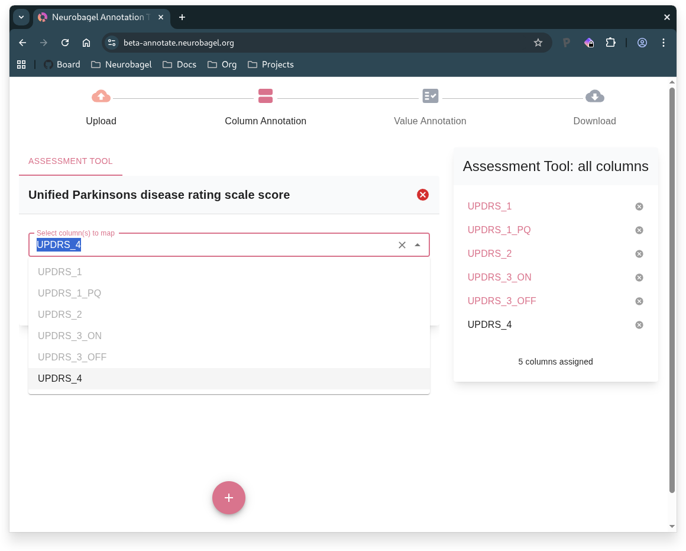

# The Neurobagel Annotation Tool

The Neurobagel annotation tool converts your data tables into standardized, machine-readable data dictionaries using FAIR vocabularies. Perfect for BIDS datasets and research data harmonization.

**Workflow summary**: Upload table → Annotate columns → Annotate values → Download dictionary

### 1. Upload

- **Upload your data table** (.tsv file) - typically `participants.tsv` from a BIDS dataset
- **Optional**: Upload a data dictionary (.json file) for extra context
   - Use `participants.json` from BIDS datasets
   - Or continue previous Neurobagel annotation work

In the following steps you annotate your table by first describing the columns and then the values within these columns.

### 2. Column Annotation

look at each column from your table and then you can:

- **Add a description** - Click "Edit" to describe what the column contains
- **Select the data type** - Choose "Categorical" for discrete values or "Continuous" for numerical measurements
- **Indicate if the column matches a standardized variable** - Select from Neurobagel standardized variables 
   - Neurobagel understands a set of predefined variables (e.g., "Age", "Sex", "Diagnosis", "Assessment tool")
   - Your task is to look through the columns in your table and identify those that contain information about these variables
   - Once a standardized variable is selected the tool will automatically infer the data type

!!! tip "When to manually select data type"
    You need to manually select the data type (Categorical or Continuous) in two cases: when your column doesn't match any standardized variable, and when you map to a multi-column measure standardized variable like "Assessment tool".
   

- **Multi-column Measures**: If you have multiple columns for the same measure like assessment tool, group them together

### 3. Value Annotation

Use the sidebar to navigate between your columns and annotate their values:

!!! note "Understanding sidebar sections"
    The sidebar groups your columns by annotation progress: **Annotated** contains columns mapped to standardized variables, **Unannotated** contains columns only with assigned data types, and **Other** contains columns that still need data type assignment.

**For continuous columns** (Age, scores):
- Select format (float, int, etc.)
- Add units description ("years", "points")

!!! info "Units vs. Format"
    **Format** refers to how the numbers in your data are structured (e.g., "float" for decimal numbers like 25.5, "int" for whole numbers like 25) whereas **Units** describe what the numbers represent (e.g., "years" for age, "points" for test scores, "mg/dL" for measurements).

**For categorical columns** (Sex, Diagnosis):
- Map each value to standardized terms
- Add descriptions for each unique value

**Handle missing or unmappable values**: Use "Mark as missing" for values that are absent, not applicable, or don't match any standardized term options

### 4. Download

- **Preview** your annotated data dictionary
- **Download** your completed file
- **Start over** with "Annotate New Dataset" if needed

Your downloaded file is BIDS-compatible and ready for Neurobagel's graph database.
