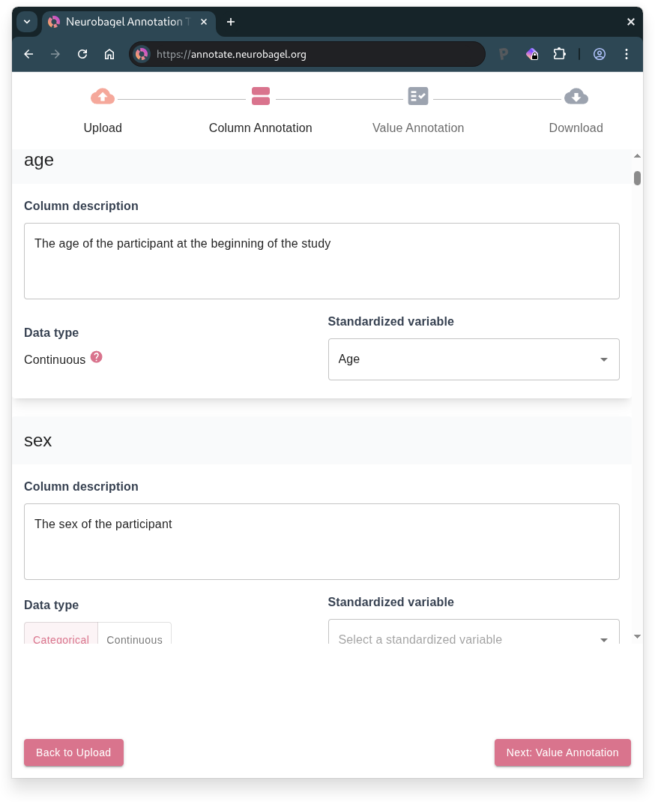

# The Neurobagel Annotation Tool

The Neurobagel annotation tool creates standardized, machine-readable data dictionaries for tabular data using curated FAIR vocabularies. The tool helps to harmonize tabular research data and is compatible with BIDS datasets.

**Workflow summary**: 

1. Upload tabular data
2. Column annotation
3. Value annotation
4. Download data dictionary

## 1. Upload tabular data

- **Upload your [data table](data_prep.md)** (.tsv file)
    - Can be `participants.tsv` from a BIDS dataset
- **Optional**: Upload an existing data dictionary (.json file) for extra context
    - Can use `participants.json` from a BIDS dataset
    - Or continue previous Neurobagel annotation work

In the following steps, you will annotate your table by first describing the columns and then the values within the columns.

## 2. Column Annotation

Each column in your uploaded table is represented as a card on this page. For each column, you can:

- **Add a description**
- **Select the [standardized variable](../data_models/variables.md) that best describes the column from the dropdown** (if a suitable match exists)
- **Select the data type** 
    - Choose "Categorical" if the column contains discrete values, "Continuous" if it contains numerical measurements, or leave it empty if neither applies
    - Columns mapped to standardized variables will have their data type inferred automatically

!!! tip "When to manually select data type"
    We recommend manually selecting the data type in two cases:

    1. When your column doesn't match any standardized variable
    2. When your column matches the "Assessment tool" standardized variable (which does not have a predefined data type since it can represent multi-column measures)

#### If your dataset has imaging (BIDS) data

The "Participant ID" standardized variable **must** be mapped to a column that contains the BIDS IDs for subjects, following the BIDS naming scheme `sub-<label>`.

For more information, see [this section](data_prep.md#if-your-dataset-has-imaging-bids-data) on preparing the phenotypic data table for a BIDS dataset.

### 2.1 Multi-column measure annotation

!!! info
    This step is only available if you have mapped columns in your data table to the "Assessment tool" standardized variable.

The card on the right lists all columns from your data table that you have mapped to the "Assessment tool" standardized variable.

1. Create a card for each assessment or instrument represented in your data by clicking :fontawesome-solid-circle-plus: and then selecting the name of the assessment from the dropdown list.
    - If no suitable match exists, the available standardized vocabulary likely cannot currently represent your assessment. 
    - To avoid incomplete annotations, un-map any column(s) corresponding to missing assessments from the "Assessment tool" standardized variable using the :octicons-x-circle-fill-16: button in the overview card.
2. Select the column(s) that describe each assessment, grouping together related columns as needed, using the dropdown on the respective assessment card.
    - You can check remaining, ungrouped columns in the overview on the right.

## 3. Value Annotation

The left sidebar displays the standardized variables that are represented in your tabular data, along with the column names that have been mapped to those variables.

Click on a standardized variable (or data type, for unannotated columns) subheading in the sidebar to display the columns corresponding to that variable (or data type). 
Then, in the column-level view on the right, navigate between the column tabs to annotate the values within each column.

??? note "Understanding sidebar sections"
    The sidebar organizes your columns by their annotation status: 

    - **Annotated** contains columns you have mapped to standardized variables
    - **Unannotated** contains columns you have not mapped to a standardized variable
        - Within this section, unannotated columns are organized based on whether you have assigned them a data type

[^1]: Attribute can only be annotated if the column has been mapped to a standardized variable.

### Columns with continuous data

For a column containing continuous data, you can:

- Add a description of the units of measurement
- Select the format of the numerical values[^1] 
- Select "Mark as missing" for any values that represent missing, unavailable, or invalid data[^1]
    - Note: the column-level view will only display unique values in the column

??? info "Units vs. Format"
    **Format** refers to how the numeric values in your data are expressed (e.g., `float` for decimal numbers like 25.5, `range` for numeric ranges like 30-35) whereas **Units** describe what the numbers represent (e.g., "years" for age, "points" for test scores, "mg/dL" for measurements).

### Columns with categorical data

For a column containing categorical data, you will be prompted to annotate the unique values detected in the column.
This includes any values that are blank (empty strings) or contain only whitespace.

For each unique column value, you can:

- Add a free-form description of the value
- Select a standardized term that best captures the meaning of the value[^1]
- Select "Mark as missing" if the value:[^1]
     - indicates missing, unavailable, or invalid data
     - OR, does not have a suitable match among the standardized term options

!!! warning
    For the value annotation to be considered complete by Neurobagel, all unique values must either be mapped to a standardized term or marked as missing.

## 4. Download data dictionary

- **Preview** your annotated data dictionary
- **Download** the data dictionary `.json` file
- **Annotate a new dataset** if desired

!!! tip
    If you see a warning about "Incomplete Annotations", you will need to return to the Value Annotation page to complete any missing annotations before your data dictionary is valid for downstream Neurobagel tools.

Your downloaded data dictionary is BIDS-compatible and, if you see the confirmation that you have successfully created a Neurobagel data dictionary, it is ready to be used to [generate data for a Neurobagel graph database](https://neurobagel.org/user_guide/cli/).
