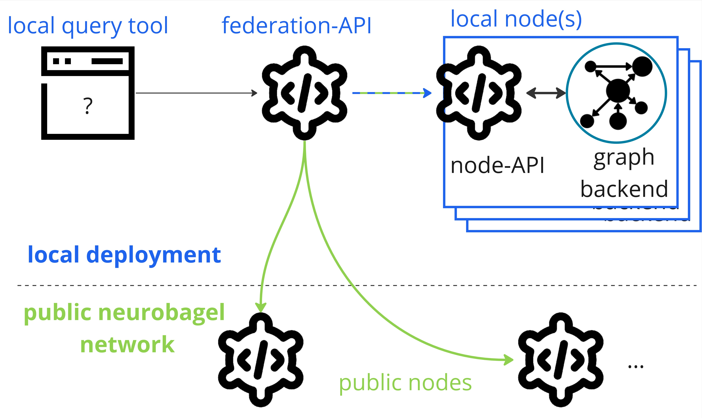

The following sections will get you started
with deploying your own [Neurobagel node](production_deployment.md#deployable-services),
a graphical query tool,
and a local federation API
(everything in blue in the picture below)
that lets you search across the data in your node and in public Neurobagel nodes.



To prepare your Neurobagel node for production use (i.e., for local or other users),
and to configure your deployment according to your specific needs,
refer to the detailed [production deployment documentation](production_deployment.md).

## Requirements

Neurobagel tools are provided as Docker containers
and are launched with Docker Compose.

!!! danger "Don't install Neurobagel tools directly on your machine"

    Please only use the Docker images provided by Neurobagel
    (or the third party providers Neurobagel relies on) and only launch
    them with our provided `docker-compose.yml` recipe.

    Do not install GraphDB locally on your computer,
    as doing so can interfere with the deployment of the Neurobagel tools.

### `docker` and `docker compose`

If you haven't yet, please install both `docker` and `docker compose`
for your operating system:

=== "Linux"

    1. [Install the Docker engine](https://docs.docker.com/engine/install/)
    and [follow the post-setup instructions](https://docs.docker.com/engine/install/linux-postinstall/)

    2. [Install Docker Compose using the repository option](https://docs.docker.com/compose/install/linux/#install-using-the-repository)

=== "Windows"

    1. [Install Docker Desktop on Windows](https://docs.docker.com/desktop/install/windows-install/).
    This will install both `docker` and `docker compose`.

    2. We strongly recommend also [installing Windows Subsystem for Linux](https://learn.microsoft.com/en-us/windows/wsl/install)
    to get a Windows-supported Linux installation for a more seamless Neurobagel deployment experience.
    Simply follow [these instructions](https://docs.docker.com/desktop/wsl/) to make your existing Docker Desktop installation (including Docker and Docker Compose) available when running WSL.

=== "MacOS"

    [Install Docker Desktop on Mac](https://docs.docker.com/desktop/install/mac-install/).
    This will install both `docker` and `docker compose` automatically.

??? warning "Linux is the only supported OS"

    We test and deploy on Linux and ensure that our
    deployment instructions work on Linux systems.

    We also try to provide docs and help for different architectures,
    but as a small team with limited resources we won't be able to
    help you debug Operating System specific problems.

Because we rely on some modern features of these
tools, please make sure you have at least the following
versions on your machine:

- `docker` engine: [v20.10.24](https://docs.docker.com/engine/release-notes/20.10/) or greater

    ```bash
    docker --version
    ```

- `docker compose`: [v2.7.0](https://github.com/docker/compose/releases/tag/v2.7.0) or above

    ```bash
    docker compose version
    ```

## Quickstart recipe

The [`neurobagel/recipes` repository](https://github.com/neurobagel/recipes)
on GitHub contains our official
Docker Compose recipe and template configuration files for setting up a local Neurobagel node.

!!! info "Production deployments require additional configuration"

    This section provide a minimal configuration for launching Neurobagel
    so you can get started quickly with trying out all services locally.
    In most cases, particularly when deploying Neurobagel for other users,
    additional configurations are necessary.

    For a complete, production-ready setup containing real-world data, see our
    [detailed instructions for production deployments](production_deployment.md).

### Clone the recipe repository

Clone the `recipes` repository from GitHub and navigate into the cloned local repo.

```bash
--8<-- "snippets/user_guide/clone_recipe.sh"
```

### Copy the template files

Make copies of the template configuration files
to use for your deployment.

```bash
--8<-- "snippets/user_guide/copy_template_files.sh"
```

You can leave these files unchanged for a local test deployment.
Our guide on [setting up a production node](production_deployment.md) has instructions
on editing these files for a production server deployment.

??? info "On a machine with an ARM-based processor?"
    The default Docker Compose recipe assumes that you are launching Neurobagel on a machine with x86_64 (AMD/Intel) architecture (most Linux or Windows machines).
    If your machine instead uses ARM-based architecture (e.g., certain Macs), **additionally change the following line in your `docker-compose.yml` file:**
    ```yml
        graph:
            image: "ontotext/graphdb:10.8.12"
    ```
    to
    ```yml
        graph:
            image: "ontotext/graphdb:10.8.12-arm64"
    ```
    You can double check the architecture of your machine in the system settings or using the command `lscpu`.

### Launch Neurobagel

Now you can launch your local Neurobagel node using Docker Compose:

```bash
docker compose up -d
```

This will:

- pull the required Docker images (if you haven't pulled them before)
- launch the containers for all [the Neurobagel services](production_deployment.md#services)
- automatically set up and configure the services based on your configuration files
- automatically upload example data to the Neurobagel graph

You can check that your docker containers have launched correctly by running:

```bash
docker ps
```

and you will want to see something like this to show all 4 services running:

```bash
❯ docker ps
CONTAINER ID   IMAGE                              COMMAND                  CREATED         STATUS         PORTS                                                 NAMES
d5e43f9ff0c2   neurobagel/federation_api:latest   "/bin/sh -c 'uvicorn…"   8 seconds ago   Up 8 seconds   0.0.0.0:8080->8000/tcp, :::8080->8000/tcp             recipes-federation-1
f0a26d0ea574   neurobagel/api:latest              "/usr/src/api_entryp…"   8 seconds ago   Up 8 seconds   0.0.0.0:8000->8000/tcp, :::8000->8000/tcp             recipes-api-1
d44d0b7359c8   ontotext/graphdb:10.8.12            "/usr/src/neurobagel…"   8 seconds ago   Up 8 seconds   0.0.0.0:7200->7200/tcp, :::7200->7200/tcp, 7300/tcp   recipes-graph-1
29a61a2d83de   neurobagel/query_tool:latest       "/bin/sh -c 'npm run…"   8 seconds ago   Up 8 seconds   0.0.0.0:3000->5173/tcp, :::3000->5173/tcp             recipes-query_federation-1
```

## Next steps

:tada: You are now the proud owner of a running Neurobagel node. Here are some things you can do now:

- Try the Neurobagel node you just deployed by accessing:
    - your own query tool at [http://localhost:3000](http://localhost:3000), and reading the [query tool usage](./query_tool.md#usage) guide
    - the interactive docs for your node API at [http://localhost:8000/docs](http://localhost:8000/docs), and reading the [API usage](./api.md) guide
- [Prepare your own dataset](./data_prep.md) for annotation with Neurobagel
- [Add your own data to your Neurobagel graph](maintaining.md#updating-the-data-in-your-graph) to search
- Learn how to make a [production deployment](production_deployment.md)
- Hopefully all went well, but if you are experiencing issues, see how to [get help](../getting_help.md)
